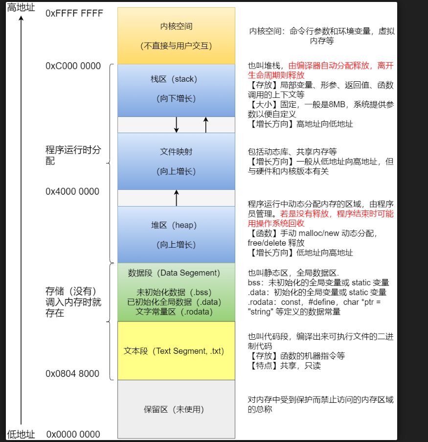

# 1.指出并修复这段代码中的问题

```c++
#include <map>
#include <iostream>

int main(){
    std::map<int, std::string> c = {
        {1, "one"}, {2, "two"}, {3, "three"},
        {4,"four"}, {5, "five"}, {6, "six"}
    };

    // erase all odd numbers from c
    for(auto it = c.begin() ; it != c.end() ; ++ it){
        if( it -> first % 2 != 0){
            c.erase(it);
        }
    }

    for(auto& p:c)
        std::cout << p.second << ' ';
    std::cout << "\n";
}

```
你的代码中有几个问题需要修复。以下是修正后的代码和说明：

修正后的代码
```cpp
#include <map>
#include <iostream>

int main() {
    std::map<int, std::string> c = {
        {1, "one"}, {2, "two"}, {3, "three"},
        {4, "four"}, {5, "five"}, {6, "six"}
    };

    // 删除所有奇数键
    for(auto it = c.begin(); it != c.end(); /* no increment here */) {
        if(it->first % 2 != 0) {
            it = c.erase(it); // 正确使用 erase，并更新迭代器
        } else {
            ++it; // 只有在没有删除时才递增
        }
    }

    for(const auto& p : c)
        std::cout << p.second << ' ';
    std::cout << "\n";

    return 0;
}
主要修改点
拼写错误: 使用 earse 是错误的，应该是 erase。
迭代器的更新: 在删除元素时，erase 返回下一个有效的迭代器，因此必须将其赋值给 it。
循环增量: 在删除元素的情况下，不应递增迭代器；只有在没有删除元素时才应递增。
返回值: 添加 return 0; 以表示程序成功结束。
现在这段代码可以正确地删除奇数键并输出剩余的值。

```

# 2.解释代码的运行结果

```cpp
#include <any>
#include <iostream>
#include <memory>

struct Base{
    int id = 0;
    ~Base() {std::cout <<  "Base destructor (" << id << ")\n";}
};

struct Derived:Base{
    ~Derived() {std::cout << "Derived destructor\n";}
};

int main(){
    std::unique_ptr<Base> up = std::make_unique<Derived>();
    up -> id = 1;
    std::shared_ptr<Base> sp = std::make_shared<Derived>();
    sp -> id = 2;
    std::any a = std::make_any<Derived>();
}
```
```shell
Derived destructor
Base destructor (0)
-------------------
Derived destructor
-------------------
Base destructor (2)
Base destructor (1)
```
我用虚线将输出分成三部分。
第一部分是a销毁时打印出来的语句。
第二部分是对象sp在构造时，右边那个std::make_shared<Derived>() 构造出来的临时对象销毁时候打印出来的语句。
第三部分是对象sp，up销毁时打印出来的语句。


# 3.内存分配问题


首先左边这个竖直的矩形，应该是进程内存图。



- 红色：静态存储区
- 蓝色：堆区
- 黄色：栈区

- other TODO


# 4.std::pmr 的作用
- TODO

# 5.谈一下 SFINAE，std::enable_if 
- TODO

# 6.extern "C" 的作用是什么（AI 回答）
在 C++ 中，`extern "C"` 是一个语言链接规范，用来告诉编译器按照 C 语言的方式对代码进行链接。它主要用于 C++ 和 C 混合编程的场景中。

### 主要作用
1. **链接方式兼容：**  
   C 和 C++ 的函数符号命名规则不同（C++ 支持函数重载，因此会对函数名进行修饰，称为 *name mangling*）。`extern "C"` 禁用了 C++ 的名字修饰，使得编译器生成的符号名与 C 的规则一致，从而实现与 C 函数的链接。

2. **跨编程语言调用：**  
   允许 C++ 程序调用 C 写的函数，或者让 C 写的代码能够调用 C++ 函数。

### 使用方法
1. **声明 C 风格的函数：**
   ```cpp
   extern "C" void myFunction();
   ```
   表示 `myFunction` 使用 C 语言的链接方式。

2. **在代码块中批量声明：**
   如果需要声明多个 C 函数，可以使用代码块：
   ```cpp
   extern "C" {
       void funcA();
       int funcB(int x);
   }
   ```

3. **与头文件结合：**
   通常，在 C++ 项目中引入 C 语言的头文件时，会在头文件中使用条件编译来兼容两种语言：
   ```cpp
   #ifdef __cplusplus
   extern "C" {
   #endif

   void myFunction();
   int anotherFunction(int x);

   #ifdef __cplusplus
   }
   #endif
   ```

### 常见场景
- **调用 C 的库：**  
  例如调用 C 标准库或其他用 C 写的库（如 SQLite、libcurl 等）。
  ```cpp
  extern "C" {
      #include <stdio.h>
  }
  ```

- **导出 C++ 函数给 C 调用：**  
  如果你需要将 C++ 写的代码暴露给 C 使用，可以用 `extern "C"` 包裹导出的函数。

### 注意事项
1. `extern "C"` 只能用于函数和全局变量，不能用于类、模板等 C++ 特有的特性。
2. 如果函数本身是用 C++ 编写的，但用了 `extern "C"`，则仍然不能使用 C++ 的特性（如函数重载）。
3. 如果在 C++ 文件中调用 C 函数，而没有加上 `extern "C"`，会因为名字修饰的不同导致链接失败。

### 总结
`extern "C"` 是 C++ 提供的一个机制，用于解决 C 和 C++ 在链接符号上的不兼容问题，方便两种语言的互操作。


## 7.如何在c++中嵌入其他语言 （AI 回答）
在 C++ 中嵌入其他语言是一个常见的需求，尤其是在需要利用其他语言的特定功能或库时。以下是一些常见的方法：

---

### 1. 嵌入 **C 语言**
C++ 是对 C 的超集，因此可以无缝调用 C 函数或嵌入 C 模块。
- **使用 `extern "C"`：**
  ```cpp
  extern "C" {
      #include "c_library.h" // C 的头文件
  }

  int main() {
      c_function(); // 调用 C 函数
      return 0;
  }
  ```
- **主要注意：**
  - 确保 C++ 编译器不会对 C 函数名进行名字修饰（*name mangling*）。
  - 在 C 的头文件中使用条件编译来兼容 C++。
    ```c
    #ifdef __cplusplus
    extern "C" {
    #endif

    void c_function();

    #ifdef __cplusplus
    }
    #endif
    ```

---

### 2. 嵌入 **Python**
可以通过 [Python C API](https://docs.python.org/3/c-api/index.html) 或嵌入解释器来运行 Python 代码。
- **示例：嵌入 Python**
  ```cpp
  #include <Python.h>

  int main() {
      Py_Initialize(); // 初始化 Python 解释器
      PyRun_SimpleString("print('Hello from Python!')"); // 执行 Python 代码
      Py_Finalize(); // 关闭 Python 解释器
      return 0;
  }
  ```
- **主要注意：**
  - 确保安装了 Python 开发头文件（如 `Python.h`）。
  - 链接时需要链接 `-lpython`。

---

### 3. 嵌入 **Lua**
Lua 是一个轻量级的嵌入式脚本语言，非常适合嵌入到 C++ 应用中。
- **示例：嵌入 Lua**
  ```cpp
  extern "C" {
      #include <lua.h>
      #include <lauxlib.h>
      #include <lualib.h>
  }

  int main() {
      lua_State *L = luaL_newstate(); // 创建 Lua 解释器
      luaL_openlibs(L); // 加载标准库

      luaL_dostring(L, "print('Hello from Lua!')"); // 执行 Lua 代码

      lua_close(L); // 关闭解释器
      return 0;
  }
  ```
- **主要注意：**
  - 链接 Lua 库（如 `-llua`）。
  - Lua 的 API 调用需要小心内存管理。

---

### 4. 嵌入 **Java**
可以通过 JNI (Java Native Interface) 来调用 Java 的方法。
- **示例：嵌入 Java**
  ```cpp
  #include <jni.h>
  #include <iostream>

  int main() {
      JavaVM *jvm;       // Java 虚拟机
      JNIEnv *env;       // JNI 环境指针
      JavaVMInitArgs vm_args; // JVM 参数
      JavaVMOption options[1];

      options[0].optionString = const_cast<char *>("-Djava.class.path=.");
      vm_args.version = JNI_VERSION_1_6;
      vm_args.nOptions = 1;
      vm_args.options = options;
      vm_args.ignoreUnrecognized = false;

      JNI_CreateJavaVM(&jvm, (void **)&env, &vm_args); // 创建 JVM

      jclass cls = env->FindClass("HelloWorld"); // 找到 Java 类
      jmethodID mid = env->GetStaticMethodID(cls, "sayHello", "()V"); // 找到方法
      env->CallStaticVoidMethod(cls, mid); // 调用方法

      jvm->DestroyJavaVM(); // 销毁 JVM
      return 0;
  }
  ```
- **主要注意：**
  - 配置 `java.class.path` 以找到 Java 类文件。
  - 使用 JNI 提供的接口调用 Java 方法。

---

### 5. 嵌入 **Shell 脚本**
可以通过调用系统命令来执行 Shell 脚本。
- **示例：调用 Shell 脚本**
  ```cpp
  #include <cstdlib>

  int main() {
      system("sh myscript.sh"); // 执行 Shell 脚本
      return 0;
  }
  ```
- **主要注意：**
  - 确保脚本有执行权限。
  - 使用 `system` 会创建一个新的进程。

---

### 6. 嵌入 **其他语言**
对于其他语言（如 Ruby、Perl 等），通常需要使用语言提供的 C API 或嵌入其解释器。

---

### 总结
嵌入其他语言的方式主要取决于目标语言的支持机制：
1. **脚本语言（Python、Lua、Ruby）：** 通常通过 C API 嵌入解释器。
2. **编译语言（C、Java）：** 使用链接机制（如 `extern "C"` 或 JNI）。
3. **Shell 和命令行工具：** 使用系统调用。

选择具体方案时需要考虑性能、语言特性以及兼容性等需求。

# 8.无锁编程可能的实现方式和缺点 (AI 回答)
无锁编程（Lock-Free Programming）是一种用于多线程编程的技术，其核心思想是通过避免使用传统的锁机制（如互斥锁）来实现线程安全的并发操作。以下是无锁编程的可能实现方式和其优缺点：

---

## **可能的实现方式**

1. **原子操作**
   - 使用硬件提供的原子指令（如 CAS：Compare-and-Swap）来实现线程间的同步。
   - CAS 的基本原理是对某个内存位置的值进行比较，如果与预期值一致，则更新为新值，否则不执行更新。
   - 示例：
     ```cpp
     std::atomic<int> counter = 0;

     void increment() {
         int expected = counter.load();
         while (!counter.compare_exchange_weak(expected, expected + 1)) {
             // CAS 失败时会返回 false，需要重试
         }
     }
     ```

2. **无锁队列**
   - 使用无锁数据结构（如 Michael & Scott 无锁队列），通过 CAS 实现无锁队列的入队和出队操作。
   - 示例：
     ```cpp
     struct Node {
         int value;
         Node* next;
     };

     std::atomic<Node*> head = nullptr;

     void push(int value) {
         Node* new_node = new Node{value, nullptr};
         Node* old_head = head.load();
         do {
             new_node->next = old_head;
         } while (!head.compare_exchange_weak(old_head, new_node));
     }
     ```

3. **无锁栈**
   - 类似于无锁队列，通过 CAS 操作实现无锁栈的入栈和出栈。
   - 常用于任务分配和线程池。

4. **单生产者-单消费者队列**
   - 在特定场景下，可以利用内存屏障等技术实现无锁的单生产者-单消费者队列。
   - 优化了性能，减少了锁竞争。

5. **环形缓冲区（Ring Buffer）**
   - 通过无锁的循环队列来实现数据的生产者-消费者模型。
   - 生产者和消费者各自维护独立的指针，避免竞争。

---

## **优点**

1. **高性能**
   - 避免了线程因锁等待而阻塞，减少了上下文切换的开销。
   - 在高并发场景下表现尤为明显。

2. **避免死锁**
   - 由于没有使用锁机制，因此不会出现死锁、优先级反转等问题。

3. **可扩展性**
   - 适用于多核处理器，能够更好地利用硬件资源。

4. **实时性**
   - 更适合对延迟敏感的场景，如实时系统。

---

## **缺点**

1. **复杂性**
   - 实现无锁算法通常比锁机制更加复杂，容易出现难以发现的错误。

2. **ABA 问题**
   - 在使用 CAS 时，如果一个变量的值从 A 变为 B，然后又变回 A，CAS 可能错误地认为值没有改变。
   - 解决方案包括使用版本号或标记等技术。

3. **资源管理问题**
   - 无锁编程中经常需要手动管理内存，可能导致内存泄漏或悬挂指针问题。
   - 解决方案包括使用垃圾回收或引用计数。

4. **硬件依赖**
   - 无锁编程通常依赖于硬件提供的原子操作指令，不同硬件平台的支持可能不一致。

5. **公平性问题**
   - 在无锁编程中，某些线程可能因为重试失败而长时间得不到执行机会。

6. **难以调试**
   - 无锁编程中的问题（如并发竞争）不易重现，调试和测试难度较大。

---

## **适用场景**
- 高并发系统（如网络服务器、数据库系统）。
- 对性能要求极高的场景（如游戏引擎、实时系统）。
- 需要避免锁开销或死锁问题的场景。

总之，无锁编程是一种强大的技术，但需要开发人员具备深厚的并发编程知识和对硬件特性的理解。在选择是否使用无锁编程时，需要权衡其带来的性能收益和开发复杂性。


# 9.什么是协程，有栈协程和无栈协程的区别

协程（Coroutine）是一种**比线程更轻量级的并发处理机制**。它是一种程序组件，可以在执行过程中暂停，并在稍后的某个时间点继续执行。协程的特点是**主动让出控制权**，而不是像线程那样由操作系统抢占式调度。

---

## **协程的特点**
1. **轻量级**：
   - 协程通常运行在单线程中，由用户代码自行调度，开销比线程小。
2. **非抢占式**：
   - 协程在代码中显式地让出控制权，而不像线程那样由操作系统随机打断。
3. **保存状态**：
   - 协程在暂停时会保存当前的执行状态（如局部变量、程序计数器等），以便恢复时继续执行。
4. **适用场景**：
   - 协程非常适合 I/O 密集型任务或需要大量上下文切换的任务，比如网络请求、游戏开发、异步编程等。

---

## **有栈协程与无栈协程的区别**

### **1. 有栈协程（Stackful Coroutine）**
- **定义**：
  每个协程拥有独立的栈空间，用于保存局部变量、函数调用链等。协程之间可以随时切换，状态保存在栈中。
- **实现方式**：
  通过操作系统的底层机制实现，比如 `setjmp/longjmp` 或汇编代码，直接操作栈指针。
- **优点**：
  1. 可以直接调用嵌套函数（支持递归）。
  2. 状态保存在独立的栈中，效率高且功能强大。
- **缺点**：
  1. 每个协程需要分配独立的栈，栈大小是固定的，占用内存较多。
  2. 实现复杂度较高。
- **适用场景**：
  - 高性能的并发场景，支持复杂的函数调用链。
- **示例语言**：
  - Lua 协程、Boost.Coroutine。

---

### **2. 无栈协程（Stackless Coroutine）**
- **定义**：
  无栈协程不维护独立的栈空间，而是通过状态机或 CPS（Continuation Passing Style）将程序的执行状态显式编码在变量中，切换时通过状态变量恢复执行。
- **实现方式**：
  - 基于状态机的实现。
  - 编译器将代码转换成状态机形式，切换时依据状态变量跳转。
- **优点**：
  1. 内存占用极小（无需独立栈）。
  2. 实现简单，便于在高层语言中使用。
- **缺点**：
  1. 不支持嵌套函数调用（递归）。
  2. 状态维护方式不够灵活，功能有限。
  3. 难以实现复杂的调用链。
- **适用场景**：
  - 简单的异步任务调度，比如事件驱动模型或协程调度器。
- **示例语言**：
  - Python 的 `async/await`、JavaScript 的 `async/await`。

---

