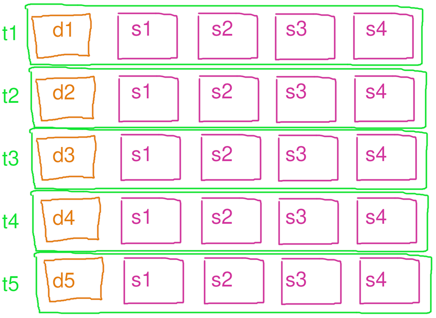
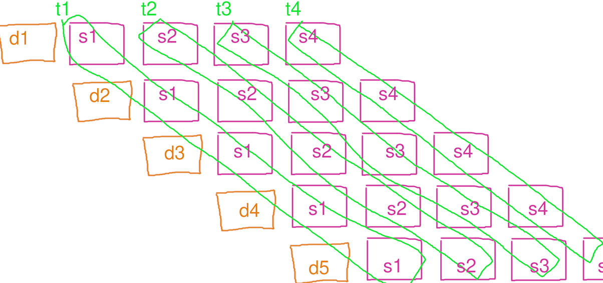
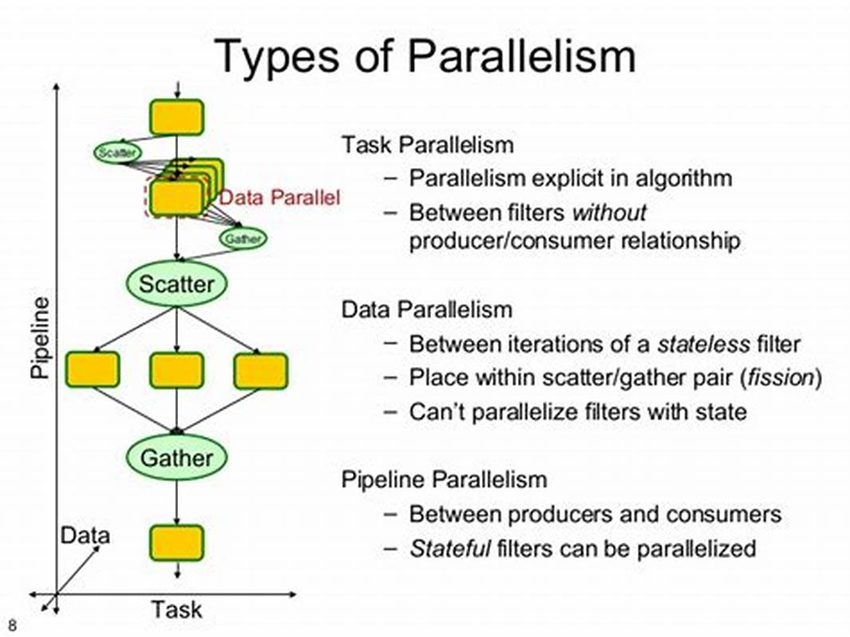

# TBB 并行编程

> reference:
>
> - https://space.bilibili.com/263032155?spm_id_from=333.337.0.0
> - https://zhuanlan.zhihu.com/p/677652569

## 一个基本程序

```c++
#include <iostream>
#include <string>
#include <tbb/task_group.h>
#include <thread>

void download(std::string file) {
  for (int i = 0; i < 10; ++i) {
    std::cout << "Downloading " << file << " (" << i * 10 << "%) ... "
              << std::endl;
    std::this_thread::sleep_for(std::chrono::milliseconds(400));
  }
  std::cout << "Download complete: " << file << "\n";
}

void interact() {
  std::string name;
  std::cin >> name;
  std::cout << "Hi, " << name << std::endl;
}
int main() {
  tbb::task_group tg;
  tg.run([&] { download("hello.zip"); });
  tg.run([&] { interact(); });
  tg.wait();
  return 0;
}

```

- 用一个任务组 tbb::task_group 启动多个任务，一个负责下载，一个负责和用户交互。并在主线程中等待该任务组里的任务全部执行完毕。

- 和多线程的用法相比，一个任务不一定对应一个线程，如果任务数量超过CPU最大的线程数，会由 TBB 在用户层负责调度任务运行在多个预先分配好的线程，而不是由操作系统负责调度线程运行在多个物理核心。

## 封装好了：parallel_invoke

```c++
#include <iostream>
#include <string>
#include <tbb/parallel_invoke.h>

int main() {
  std::string s = "hello, world!";
  char ch = 'l';
  tbb::parallel_invoke(
      [&] {
        for (int i = 0; i < s.size() / 2; ++i) {
          if (s[i] == ch)
            std::cout << "Found char " << ch << " at position " << i
                      << std::endl;
        }
      },
      [&] {
        for (int i = s.size() / 2; i < s.size(); ++i) {
          if (s[i] == ch)
            std::cout << "Found char " << ch << " at position " << i
                      << std::endl;
        }
      });
  return 0;
}
```

## 并行循环

```c++
void case0() {
  size_t n = 1 << 26;
  std::cout << "n = " << n << std::endl;
  std::vector<float> a(n);
  tbb::parallel_for(tbb::blocked_range<size_t>(0, n),
                    [&](const tbb::blocked_range<size_t> &r) {
                      for (size_t i = r.begin(); i != r.end(); ++i) {
                        a[i] = std::sqrt(a[i]);
                      }
                    });
}
```

1. 定义数组的大小 `n`，这里 `n` 是 \(2^{26}\)：

   ```cpp
   size_t n = 1 << 26;
   ```

2. 创建一个大小为 `n` 的浮点数向量 `a`：

   ```cpp
   std::vector<float> a(n);
   ```

3. 使用 `tbb::parallel_for` 并行处理数组 `a`：

   ```cpp
   tbb::parallel_for(tbb::blocked_range<size_t>(0, n),
                     [&](const tbb::blocked_range<size_t> &r) {
                       for (size_t i = r.begin(); i != r.end(); ++i) {
                         a[i] = std::sqrt(a[i]);
                       }
                     });
   ```

   - `tbb::blocked_range<size_t>(0, n)` 定义了并行处理的范围，从 0 到 `n`。
   - Lambda 函数 `&[&](const tbb::blocked_range<size_t> &r)` 定义了并行执行的操作。
   - 在每个并行块中，计算数组 `a` 中每个元素的平方根。

### 其他用法

```c++
// 基于下标
void parallel_for(Index first , Index last , const Function &f);
// 基于迭代器区间
void parallel_for_each(Iterator first, Iterator last, const Body &body);
```

详细调用例子 [parallel_for.cpp](./parallel_for.cpp)

## 缩并 (reduce)

在并行计算中，reduce（归约）是一种常见的操作，用于将多个值组合成一个单一的值。这个过程通常涉及对一组数据应用一个二元操作（如加法、乘法、最大值等），并将结果逐步合并。

例如，在并行计算中，可以将一个大数组分成多个子数组，并行地对每个子数组进行归约操作，然后再将这些中间结果合并成最终结果。

这种技术在处理大规模数据时非常有用，因为它可以显著减少计算时间。常见的并行归约操作包括求和、求积、求最大值和最小值等。

```bash
大数组: [1, 2, 3, 4, 5, 6, 7, 8]

分割成子数组:
[1, 2] [3, 4] [5, 6] [7, 8]

并行归约操作:
  1 + 2 = 3
  3 + 4 = 7
  5 + 6 = 11
  7 + 8 = 15

合并中间结果:
[3, 7, 11, 15]

再次归约:
  3 + 7 = 10
  11 + 15 = 26

最终结果:
  10 + 26 = 36
```

reduce可以用分治实现，也可以用tbb的reduce接口实现, 用并行实现reduce的好处就是可以减少因“数据累计过多导致的浮点误差”，详见 [parallel_reduce.cpp](./parallel_reduce.cpp)

### parallel_deterministic_reduce 的特点

`parallel_deterministic_reduce` 和 `parallel_reduce` 都是 Intel TBB (Threading Building Blocks) 库中的并行算法，用于在并行环境中进行归约操作。它们的主要区别在于结果的确定性和一致性：

1. **parallel_reduce**:

   - 用于并行归约操作。
   - 结果可能是不确定的，因为不同的线程可能以不同的顺序执行操作。
   - 适用于不需要确定性结果的场景。

2. **parallel_deterministic_reduce**:
   - 也是用于并行归约操作。
   - 保证结果的确定性，即无论多少次运行，结果都是一致的。
   - 适用于需要确定性结果的场景。

简单来说，`parallel_deterministic_reduce` 在并行归约操作中提供了确定性，而 `parallel_reduce` 则不保证结果的一致性。
`parallel_deterministic_reduce` 提供确定性的原因在于它在并行归约操作中确保了操作的顺序和组合方式的一致性。具体来说，它通过以下方式实现确定性：

1. **固定的任务划分**：`parallel_deterministic_reduce` 会以固定的方式将任务划分给不同的线程，这样每次运行时任务划分都是相同的。
2. **固定的归约顺序**：在归约操作中，`parallel_deterministic_reduce` 保证了每次归约操作的顺序是固定的，不会因为线程调度的不同而改变。

这种确定性对于某些应用场景非常重要，例如需要重复运行并比较结果的科学计算、金融计算等。通过使用 `parallel_deterministic_reduce`，可以确保每次运行的结果都是一致的，从而避免由于并行执行顺序不同而导致的结果不一致问题。

## 扫描 (scan)

在并行计算中，`scan`（也称为前缀和或前缀扫描）是一种常见的并行算法，用于计算一个数组的前缀和。具体来说，`scan` 操作会生成一个新的数组，其中每个元素是原数组中从起始位置到当前元素的累加和。

例如，给定一个数组 `[a, b, c, d]`，`scan` 操作的结果是 `[a, a+b, a+b+c, a+b+c+d]`。

`scan` 操作有两种主要形式：

1. **Inclusive Scan**：包括当前元素在内的前缀和。例如，`[a, a+b, a+b+c, a+b+c+d]`。
2. **Exclusive Scanjj**：不包括当前元素的前缀和。例如，`[0, a, a+b, a+b+c]`。

在并行计算中，`scan` 操作可以通过分治法高效地实现。它通常分为两个阶段：

1. **上升阶段（Reduction Phase）**：构建一个树结构，从底部向顶部累加部分和。
2. **下降阶段（Downsweep Phase）**：从顶部向底部传播累加和，计算最终的前缀和。

代码详见: [parallel_scan.cpp](./parallel_scan.cpp)

## 性能测试

参考: [google benchmark](../google_benchmark/README.md)

### 评价加速效果的指标

- 公式：加速比 = 串行用时÷并行用时
- 理想加速比应该是核心的数量。

运行 [benchmark_test.cpp](./benchmark_test.cpp)
得到如下结果

```
--------------------------------------------------------
Benchmark              Time             CPU   Iterations
--------------------------------------------------------
BM_for        3266357406 ns   3266316800 ns            1
BM_tbb_for     316472163 ns    316469350 ns            2
BM_reduce      500346414 ns    500321850 ns            2
BM_tbb_reduce   54913544 ns     54911518 ns           11
```

for 部分的加速比为 3266357406 / 316472163 = 10.321152340972246
reduce 部分加速比为 500346414 / 54913544 = 9.111530190074784

加速比会受 计算类型 (内存密集型 /是计算密集型)，以及测试机器的配置影响。因为不同的计算类型会遇到的瓶颈不一样。

[【译】理解物理 CPU 与逻辑 CPU](https://juejin.cn/post/6929488631325261837)

## 任务域 tbb::task_arena

tbb::task_arena 是 Intel Threading Building Blocks (TBB) 库中的一个类，用于管理任务的执行域。它允许用户创建独立的任务调度环境，从而实现对并行任务的更细粒度的控制。

主要功能和特点

- 独立的任务调度：
  - tbb::task_arena 允许用户在独立的调度域中运行任务，避免与全局任务调度器的冲突。
- 并行执行：
  - 支持并行任务的执行，利用多核处理器的优势来提升性能。
- 资源控制：
  - 通过 tbb::task_arena，用户可以控制并发级别，指定任务的最大并发线程数。

## 嵌套 for 死锁问题

TBB 用了工作窃取法来分配任务：当一个线程 t1 做完自己队列里全部的工作时，会从另一个工作中线程 t2 的队列里取出任务，以免 t1 闲置浪费时间。

因此, 如果存在一个嵌套的循环，内部 for 循环有可能“窃取”到另一个外部 for 循环的任务，从而导致 mutex 被重复上锁。

下面是对应的代码:

```cpp
#include <cmath>
#include <iostream>
#include <mutex>
#include <tbb/parallel_for.h>
#include <vector>

int main() {
  size_t n = 1 << 13;
  std::vector<float> a(n * n);
  std::mutex mtx;

  tbb::parallel_for((size_t)0, (size_t)n, [&](size_t i) {
    tbb::parallel_for((size_t)0, (size_t)n, [&](size_t j) {
      std::lock_guard<std::mutex> lock(mtx);
      a[i * n + j] = std::sin(i) * std::cos(j);
    });
  });
}
```

解决方式分别包括以下几种

- 使用 `递归锁 std::recursive_mutex` （更多参考 [mutex](../../code/mutex/README.md)
- 在第一层循环内部使用 `tbb::task_arena`, 让调度隔离。不同工作域直接不会相互窃取工作。
- 同一个任务域，但用 `tbb::this_task_arena::isolate` 隔离，禁止其内部的工作被窃取（推荐）

详见文件 [nested_parallel_for](./nested_parallel_for.cpp)

## 任务调度

这个topic主要关注的是并行计算如何将任务分配给每个线程,以充分利用系统资源。

思路：

- 1.线程数量超过CPU核心数量，让系统调度保证各个核心始终饱和
- 2.线程数量不变，但是用一个队列分发和认领任务
- 3.每个线程一个任务队列，做完本职工作后可以认领其他线程的任务，这个也叫做任务窃取法

### tbb任务划分机制

（1）静态均匀划分static_partitioner
这种策略是将任务均匀的划分到不同的线程，对于每个任务计算复杂度一样的任务效果很好。例子代码如下：

```c++
int main() {
    size_t n = 32;
    tbb::task_arena ta(4);
    ta.execute([&]
    {
        tbb::parallel_for(tbb::blocked_range<size_t>(0, n),
        [&] (tbb::blocked_range<size_t> r)
        {
            mtprint("thread", tbb::this_task_arena::current_thread_index(), "size", r.size());
            std::this_thread::sleep_for(std::chrono::milliseconds(400));
        }, tbb::static_partitioner{});
    });

    return 0;

}
```

执行结果如下： thread 0 size 8 thread 1 size 8 thread 2 size 8 thread 3 size 8 创建了4个线程4个任务，每个任务包含8个元素。

另外可以指定区间的粒度，将tbb::parallel_for(tbb::blocked_range<size_t>(0, n)改为tbb::parallel_for(tbb::blocked_range<size_t>(0, n, 16)，执行的结果如下： thread 0 size 16 thread 1 size 16 创建了2个线程2个任务，每个任务包含16个元素。

（2）、简单划分策略simple_partitioner
例子如下：

```c++
int main() {
  size_t n = 32;

    tbb::task_arena ta(4);
    ta.execute([&] {
        tbb::parallel_for(tbb::blocked_range<size_t>(0, n),
        [&] (tbb::blocked_range<size_t> r)
        {
            for (size_t i = r.begin(); i < r.end(); i++)
            {
                mtprint("thread", tbb::this_task_arena::current_thread_index(),
                        "size", r.size(), "begin", r.begin());
                std::this_thread::sleep_for(std::chrono::milliseconds(i * 10));
            }
        }, tbb::simple_partitioner{});
    });
    return 0;
}
```

执行结果如下： thread 0 size 1 begin 0 thread 0 size 1 begin 1 thread 1 size 1 begin 16 thread 2 size 1 begin 8 thread 3 size 1 begin 12 thread 0 size 1 begin 2 thread 0 size 1 begin 3 thread 0 size 1 begin 4 thread 2 size 1 begin 9 thread 0 size 1 begin 5 thread 3 size 1 begin 13 thread 0 size 1 begin 6 thread 1 size 1 begin 17 thread 2 size 1 begin 10 thread 0 size 1 begin 7 thread 3 size 1 begin 14 thread 2 size 1 begin 11 thread 0 size 1 begin 15 thread 1 size 1 begin 18 thread 2 size 1 begin 24 thread 3 size 1 begin 20 thread 0 size 1 begin 22 thread 1 size 1 begin 19 thread 3 size 1 begin 21 thread 2 size 1 begin 25 thread 0 size 1 begin 23 thread 1 size 1 begin 28 thread 3 size 1 begin 26 thread 2 size 1 begin 30 thread 0 size 1 begin 29 thread 1 size 1 begin 31 thread 3 size 1 begin 27

创建了 4 个线程 32 个任务，每个任务包含 1 个元素

另外，也可以指定区间的粒度大小，将tbb::parallel_for(tbb::blocked_range<size_t>(0, n)改为tbb::parallel_for(tbb::blocked_range<size_t>(0, n, 4)

创建了 4 个线程 8 个任务，每个任务包含 4 个元素

（3）自动划分机制 auto_partitioner
根据lambada的执行时间，自动选择合适的划分策略。也是没有指定划分策略时的默认策略。

（4）根据历史经验自动负载均衡策略 affinity_partitioner
根据程序的历史执行时间，进行划分，重复运行同样的实例，时间会越来越少。

总结，需要根据具体问题的特性来选择，并且要多实验。例如简单话费配合合适的跨距会比自动划分的性能要高很多。

> 完整代码见 [assign_task](./assign_task.cpp)

## 并发容器

并发容器主要是对标stl的容器，主要有`vector`/`list`/`map`/`set`等。命名都叫 `tbb::concurrent_{container name}`

不连续的 `tbb::concurrent_vector` , `std::vector` 造成指针失效的根本原因在于他必须保证内存是连续的，从而不得不在扩容时移动元素。

因此可以用 `tbb::concurrent_vector`，他不保证元素在内存中是连续的。换来的优点是 `push_back` 进去的元素，扩容时不需要移动位置，从而指针和迭代器不会失效。 同时他的 `push_back` 会额外返回一个迭代器（`iterator`），指向刚刚插入的对象。

`push_back` 一次只能推入一个元素。 而 `grow_by(n)` 则可以一次扩充 `n` 个元素。他同样是返回一个迭代器（`iterator`），之后可以通过迭代器的 `++` 运算符依次访问连续的 `n` 个元素，`*` 运算符访问当前指向的元素。

除了内存不连续、指针和迭代器不失效的特点，`tbb::concurrent_vector` 还是一个多线程安全的容器，能够被多个线程同时并发地 `grow_by` 或 `push_back` 而不出错。 而 `std::vector` 只有只读的 `.size()` 和 `[]` 运算符是安全的，且不能和写入的 `push_back` 等一起用，否则需要用读写锁保护。

因为 `tbb::concurrent_vector` 内存不连续的特点，通过索引访问，比通过迭代器访问的效率低一些。 因此不推荐像`a[i]`这样通过索引随机访问其中的元素，`*(it + i)`这样需要迭代器跨步访问的也不推荐。

最好的方式是用`begin()`和`end()`的迭代器区间，按顺序访问。比如

```c++
int main(){
  tbb::concurrent_vector<float> a(n);
  for(auto it = a.begin() ; it != a.end(); ++ it){
    *it += 1.0f;
  }
}
```

### parallel_for 也支持迭代器

`tbb::blocked_range` 的参数不一定是 `size_t`，也可以是迭代器表示的区间。

这样 `lambda` 体内 `r` 的 `begin` 和 `end` 也会返回 `tbb::concurrent_vector` 的迭代器类型。

```c++
tbb::concurrent_vector<float> a(n);
tbb::parallel_for(tbb::blocked_range(a.begin(), a.end()),
  [&](tbb::blocked_range<decltype(a.begin())> r){
    for(auto it = r.begin() ; it != r.end() ; ++ it){
      *it += 1.0f;
    }
  });
```

在上面的代码中

第一个 `tbb::blocked_range` 尖括号里的类型可以省略是因为 C++17 的 CTAD 特性。第二个则是用了 decltype 自动推导，也可以 (auto r)，这里写具体类型仅为教学目的

# 并行计算常见场景

## 并行筛选

假设现在有一个任务，是要筛选出所有大于0的sin(i)的数。串行状态下，这个代码为

```c++
int main() {
    size_t n = 1<<27;
    std::vector<float> a;

    for (size_t i = 0; i < n; i++) {
        float val = std::sin(i);
        if (val > 0) {
            a.push_back(val);
        }
    }

    return 0;
}
```

在个人电脑上，这个运行时间是 4.56128 s, 下面讨论用tbb提供的工具可以做到的优化的方案。

### 优化方案1

用多线程安全的 concurrent_vector 动态追加数据， 代码如下：

```c++
// 优化方案1
void case1(){
    tbb::concurrent_vector<float> a;

    tbb::parallel_for(tbb::blocked_range<size_t>(0, n),
    [&] (tbb::blocked_range<size_t> r) {
        for (size_t i = r.begin(); i < r.end(); i++) {
            float val = std::sin(i);
            if (val > 0) {
                a.push_back(val);
            }
        }
    });
}
```

运行时间: 2.23559 s

### 优化方案2

先推到线程局部（thread-local）的 vector，最后一次性推入到concurrent_vector 可以避免频繁在concurrent_vector上产生锁竞争 , 代码如下：

```c++
void case2(){
  tbb::concurrent_vector<float> a;

  tbb::parallel_for(tbb::blocked_range<size_t>(0, n),
  [&] (tbb::blocked_range<size_t> r) {
      std::vector<float> local_a;
      for (size_t i = r.begin(); i < r.end(); i++) {
          float val = std::sin(i);
          if (val > 0) {
              local_a.push_back(val);
          }
      }
      auto it = a.grow_by(local_a.size());
      for (size_t i = 0; i < local_a.size(); i++) {
          *it++ = local_a[i];
      }
  });
}
```

运行时间： 1.64293 s

### 优化方案3

线程局部的vector调用reserve预先分配一定内存，避免push_back反复扩容时的分段式增长 同时利用标准库的std::copy模板简化了代码

```c++
void case3(){
  tbb::concurrent_vector<float> a;

    tbb::parallel_for(tbb::blocked_range<size_t>(0, n),
    [&] (tbb::blocked_range<size_t> r) {
        std::vector<float> local_a;
        local_a.reserve(r.size());
        for (size_t i = r.begin(); i < r.end(); i++) {
            float val = std::sin(i);
            if (val > 0) {
                local_a.push_back(val);
            }
        }
        auto it = a.grow_by(local_a.size());
        std::copy(local_a.begin(), local_a.end(), it);
    });

}
```

运行时间： 1.55772 s

### 优化方案4（保证结果是连续存储）

如果需要筛选后的数据是连续的，即a是个 std::vector，这时就需要用mutex锁定，避免数据竞争。

```c++
void case4(){
  std::vector<float> a;
  std::mutex mtx; // 这里其实也可以换成 tbb::spin_mutex

  a.reserve(n * 2 / 3);
  tbb::parallel_for(tbb::blocked_range<size_t>(0, n),
  [&] (tbb::blocked_range<size_t> r) {
      std::vector<float> local_a;
      local_a.reserve(r.size());
      for (size_t i = r.begin(); i < r.end(); i++) {
          float val = std::sin(i);
          if (val > 0) {
              local_a.push_back(val);
          }
      }
      std::lock_guard lck(mtx);
      std::copy(local_a.begin(), local_a.end(), std::back_inserter(a));
  });

}
```

运行时间： 2.27085 s

## 分治和排序

首先看一个并行版本的 斐波那契数列函数, 来了解并行计算在分治算法中的应用。

```c++
int fib(int n=39){
    if (n < 2)
        return n;
    int first , second;
    tbb::parallel_invoke([&]{
        first = fib(n - 1);
    } , [&]{
        second = fib(n -2 );
    });
    return first + second;
}

```

运行时间： 3.3552s

这个函数每进入一个递归就开启一个新的任务，这对系统来说调度负担太重了，
可以做以下优化,让任务划分得够细时，转为串行，缓解调度负担

```c++
int serial_fib(int n){
    if(n < 2)
        return n;
    int first =serial_fib(n - 1);
    int second = serial_fib(n - 2);
    return first + second;
}
int fib2(int n=39){
    if (n < 29)
        return serial_fib(n);
    int first , second;
    tbb::parallel_invoke([&]{
        first = fib2(n - 1);
    } , [&]{
        second = fib2(n -2 );
    });
    return first + second;
}


```

运行时间： 0.0642986s

### 实现一个qsort

根据上面分治的思想，我们可以实现一个快速排序算法。

```c++
template <class T>
void quick_sort(T *data, size_t size) {
  if (size < 1)
    return;
  if (size < (1 << 16)) {
    std::sort(data, data + size, std::less<T>{});
    return;
  }
  size_t mid = std::hash<size_t>{}(size);
  mid ^= std::hash<void *>{}(static_cast<void *>(data));
  mid %= size;
  std::swap(data[0], data[mid]);
  T pivot = data[0];
  size_t left = 0, right = size - 1;
  while (left < right) {
    while (left < right && !(data[right] < pivot))
      right--;
    if (left < right)
      data[left++] = data[right];
    while (left < right && data[left] < pivot)
      left++;
    if (left < right)
      data[right--] = data[left];
  }
  data[left] = pivot;
  tbb::parallel_invoke([&] { quick_sort(data, left); },
                       [&] { quick_sort(data + left + 1, size - left - 1); });
}
```

### tbb 排序

tbb提供了tbb::parallel_sort供我们进行并行的排序。

```c++
void sort(){
    size_t n = 1<<24;
    std::vector<int> arr(n);
    std::generate(arr.begin(), arr.end(), std::rand);
    TICK(tbb_parallel_sort);
    tbb::parallel_sort(arr.begin(), arr.end(), std::less<int>{});
    TOCK(tbb_parallel_sort);
}
```

> 上面所有完整代码见 [divide_conquer_sort_example](./divide_conquer_sort_example.cpp)

## 流水线并行

假设现在有一个数据结构叫 `Data` , 我们要分步骤对这个`Data`里面的数据做操作，于是我们抽象出接口 `step1`, `step2` , `step3`, `step4`

```c++
struct Data {
    std::vector<float> arr;

    Data() {
        arr.resize(std::rand() % 100 * 500 + 10000);
        for (int i = 0; i < arr.size(); i++) {
            arr[i] = std::rand() * (1.f / (float)RAND_MAX);
        }
    }

    void step1() {
        for (int i = 0; i < arr.size(); i++) {
            arr[i] += 3.14f;
        }
    }

    void step2() {
        std::vector<float> tmp(arr.size());
        for (int i = 1; i < arr.size() - 1; i++) {
            tmp[i] = arr[i - 1] + arr[i] + arr[i + 1];
        }
        std::swap(tmp, arr);
    }

    void step3() {
        for (int i = 0; i < arr.size(); i++) {
            arr[i] = std::sqrt(std::abs(arr[i]));
        }
    }

    void step4() {
        std::vector<float> tmp(arr.size());
        for (int i = 1; i < arr.size() - 1; i++) {
            tmp[i] = arr[i - 1] - 2 * arr[i] + arr[i + 1];
        }
        std::swap(tmp, arr);
    }
};
```

在串行情况下，可以这样对数据做处理

```c++
void seq_process(){
    size_t n = 1<<12;

    std::vector<Data> dats(n);

    TICK(seq_process);
    for (auto &dat: dats) {
        dat.step1();
        dat.step2();
        dat.step3();
        dat.step4();
    }
    TOCK(seq_process);
}
```

### 简单粗暴的并行处理

可以用 parallel_for 将这个循环直接并行优化起来

```c++
void parallel_for_process() {
  size_t n = 1 << 12;
  std::vector<Data> dats(n);
  TICK(parallel_for_process)
  tbb::parallel_for_each(dats.begin(), dats.end(), [&](Data &dat) {
    dat.step1();
    dat.step2();
    dat.step3();
    dat.step4();
  });
  TOCK(parallel_for_process);
}
```


循环体太大，每跑一遍指令缓存和数据缓存都会重新失效一遍。且每个核心都在读写不同地方的数据，不能很好的利用三级缓存，导致内存成为瓶颈。

### 解决指令缓存失效问题

我们可以让每个并行调度都专门执行一个步骤，这样解决指令缓存失效问题。像这样

```c++
void parallel_for_process2(){
    size_t n = 1 << 12;
    std::vector<Data> dats(n);
    TICK(parallel_for_process_2)
    tbb::parallel_for_each(dats.begin(), dats.end(), [&](Data &dat) {
      dat.step1();
    });
    tbb::parallel_for_each(dats.begin(), dats.end(), [&](Data &dat) {
      dat.step2();
    });
    tbb::parallel_for_each(dats.begin(), dats.end(), [&](Data &dat) {
      dat.step3();
    });
    tbb::parallel_for_each(dats.begin(), dats.end(), [&](Data &dat) {
      dat.step4();
    });
    TOCK(parallel_for_process_2);
}
```

但是三次独立的for循环每次结束都需要同步，一定程度上妨碍了CPU发挥性能；而且每个step后依然写回了数组，数据缓存没法充分利用。

### tbb流水线并行



流水线模式下每个线程都只做自己的那个步骤（filter），从而对指令缓存更友好。且一个核心处理完的数据很快会被另一个核心用上，对三级缓存比较友好，也节省内存。

```cpp
auto it = dats.begin();
tbb::parallel_pipeline(
    8,
    tbb::make_filter<void, Data *>(tbb::filter_mode::serial_in_order,
                                   [&](tbb::flow_control &fc) -> Data * {
                                     if (it == dats.end()) {
                                       fc.stop();
                                       return nullptr;
                                     }

                                     return &*it++;
                                   }),
    tbb::make_filter<Data *, Data *>(tbb::filter_mode::parallel,
                                     [&](Data *dat) -> Data * {
                                       dat->step1();
                                       return dat;
                                     }),
    tbb::make_filter<Data *, Data *>(tbb::filter_mode::parallel,
                                     [&](Data *dat) -> Data * {
                                       dat->step2();
                                       return dat;
                                     }),
    tbb::make_filter<Data *, Data *>(tbb::filter_mode::parallel,
                                     [&](Data *dat) -> Data * {
                                       dat->step3();
                                       return dat;
                                     }),
    tbb::make_filter<Data *, void>(tbb::filter_mode::parallel,
                                   [&](Data *dat) -> void { dat->step4(); })
);
```

这个代码片段使用了英特尔线程构建块（Intel Threading Building Blocks，简称TBB）库来创建一个并行流水线。下面是对语法的解释以及各部分代码的功能说明：

#### 解释：

1. **创建流水线：**

   ```cpp
   tbb::parallel_pipeline(
       8,
       ...
   );
   ```

   - `tbb::parallel_pipeline` 用于创建一个最多有 8 个并行阶段的流水线。

2. **过滤器：**

   - `tbb::make_filter` 函数用于为流水线创建过滤器。每个过滤器处理数据并将其传递到下一个过滤器。

   **第一个过滤器（顺序串行模式）：**

   ```cpp
   tbb::make_filter<void, Data *>(tbb::filter_mode::serial_in_order,
                                  [&](tbb::flow_control &fc) -> Data * {
                                    if (it == dats.end()) {
                                      fc.stop();
                                      return nullptr;
                                    }
                                    return &*it++;
                                  })
   ```

   - 这个过滤器以串行模式运行，并按顺序处理数据。
   - 它使用迭代器 `it` 从 `dats` 容器中获取数据。
   - 如果迭代器到达容器的末尾，它会停止流控制。
   - `tbb::make_filter<void , Data *>` 说明这个过滤器不需要接收输入， 但是会生成类型为 Data\*

   **第二个过滤器（并行模式）：**

   ```cpp
   tbb::make_filter<Data *, Data *>(tbb::filter_mode::parallel,
                                    [&](Data *dat) -> Data * {
                                      dat->step1();
                                      return dat;
                                    })
   ```

   - 这个过滤器以并行模式运行。
   - 它通过调用 `step1` 方法处理每个 `Data` 对象。
   - `tbb::make_filter<Data *, Data *>` 说明这个过滤器会处理类型为 Data* 的输入数据，并生成类型为 Data*
   - 过滤器接受的数据来自于上一个过滤器的输出。

#### 总结：

代码设置了一个有五个阶段的流水线：

1. 第一个阶段从 `dats` 容器中获取数据。
2. 第二、三、四，五个阶段通过调用 `step1`、`step2` 、 `step3` 和 `step4`方法分别处理数据。

除了第一个阶段，其余阶段都是并行运行的，从而实现数据的并发处理。

### 流水线的适用场景

- 流水线式的并行，因为每个线程执行的指令之间往往没有关系，主要适用于各个核心可以独立工作的 CPU，GPU 上则有 stream 作为替代。

- 流水线额外的好处是可以指定一部分 filter 为串行的（如果他们没办法并行调用的话）而其他 filter 可以和他同时并行运行。这可以应对一些不方便并行，或者执行前后的数据有依赖，但是可以拆分成多个步骤（filter）的复杂业务。

- 还有好处是他无需先把数据全读到一个内存数组里，可以流式处理数据（on-fly），节省内存。

- 不过需要注意流水线每个步骤（filter）里的工作量最好足够大，否则无法掩盖调度overhead

# 各种并行模式总结

- 任务并行，对应 parallel_invoke
- 数据并行，对应 parallel_for / parallel_reduce ...
- 流水线并行，对应 parallel_pipeline ...
  

