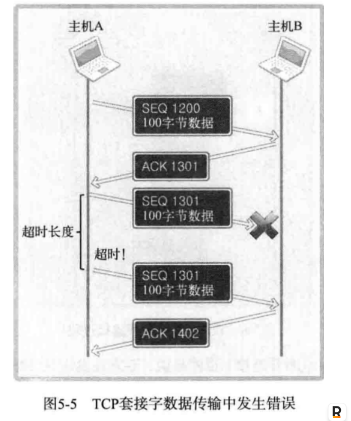
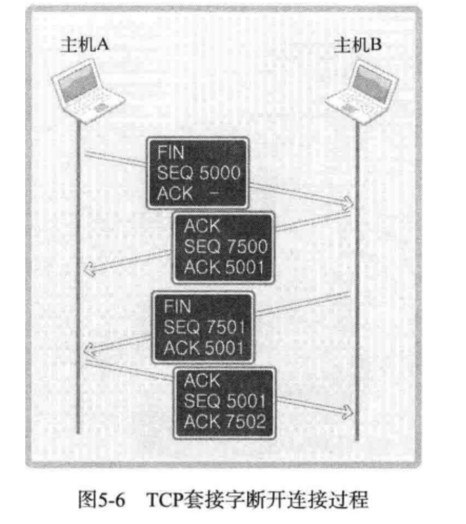

# 《TCP/IP 网络编程》学习笔记

ref: https://github.com/riba2534/TCP-IP-NetworkNote/tree/master

# CH1 理解网络编程和套接字

## 1.1 理解网络编程和套接字

### 1.1.1 构建网络套接字

以电话机打电话的方式来理解套接字。套接字是用来网络编程的工具，他就像是现实生活中的电话, 一个让两个进程（跨机器）进行交流的“电话”。

下面有几个基本的api

```c++
#include <sys/socket.h>

int socket(int domain, int type, int protocol)
// “买一个电话”，成功就返回文件描述符，失败时返回 -1

int bind(int sockfd, struct sockaddr *myaddr , sock)
// “给电话分配一个电话号码”， 成功时候返回 0 ， 失败时返回 -1

int listen(int sockfd, int backlog);
// "连上电话线，转成可接听状态", 成功时候返回 0 ， 失败时返回 -1


int accept(int sockfd, struct sockaddr *addr, socklen_t *addrlen);
// "电话响了，接电话" , 成功时返回文件描述符，失败时返回-1

```

网络编程中和接受连接请求的套接字创建过程可整理如下：

- 第一步：调用 socket 函数创建套接字。
- 第二步：调用 bind 函数分配IP地址和端口号。
- 第三步：调用 listen 函数转换为可接受请求状态。
- 第四步：调用 accept 函数受理套接字请求

### 1.1.2 编写`Hello World`套接字程序

下面会演示一个最简单的server和client，代码里很多细节书中会逐渐讲到，这里只需要
知道整个流程步骤。

- 服务端 \*

服务器端（server）是能够受理连接请求的程序。下面构建服务端以验证之前提到的函数调用过程，该服务器端收到连接请求后向请求者返回Hello World!答复。除各种函数的调用顺序外，我们还未涉及任何实际编程。因此，阅读代码时请重点关注套接字相关的函数调用过程，不必理解全过程。

服务器端代码请参见：[hello_server.c](./ch01/hello_server.c)

- 客户端 \*

客户端程序只有调用 socket 函数创建套接字 和 调用 connect 函数向服务端发送连接请求这两个步骤，下面给出客户端，需要查看以下两方面的内容：

调用 socket 函数 和 connect 函数
与服务端共同运行以收发字符串数据
客户端代码请参见：[hello_client.c](./ch01/hello_client.c)

## 1.2 基于Linux文件的操作

Linux 将 socket 视为文件。文件和套接字一般经过创建过程才会被分配文件描述符。 在上面的代码里 socket （整数类型） 就是一个文件描述符。
因此在网络数据传输层中，可以使用Linux I/O 相关函数。下面是一些基本的I/O操作api。

```c++
#include <sys/types.h>
#include <sys/stat.h>
#include <fcntl.h>

int open(const char* path, int flag);
/*
 return file describer when success
 path: string of file path
 flag: open mode

    O_CREAT : create file if necessary
    O_TRUNC : 删除所有数据
    O_APPEND: 在文件末尾追加数据
    O_RDONLY: 只读打开
    O_WRONLYL: 只写打开
    O_RDWR: 读写打开

/*

int close(int fd);
/*
 成功时返回 0， 失败时返回-1
 fd：要关闭的文件或套接字的文件描述符
*/


ssize_t write(int fd, const void *buf, size_t nbytes)
/*
 成功时返回写入的字节数，失败时返回 -1
 fd 显示数据传输对象的文件描述符
 buf 保存要传输数据的缓冲值地址
 nbytes 要传输数据的字节数
*/


ssize_t read(int fd, void *buf , size_t nbytes)
/*
 成功时返回接收的字节数，遇到文件结尾会返回0，失败返回 -1
 fd: 数据传输对象的文件描述符
 buf: 保存接收到的数据的缓冲地址值
 nbytes: 要接收数据的最大字节数
*/


```

现在尝试用这些api创建一个文件 data.txt ，并往里面写 "Hi,Charles", 代码见 [low_write.c](./ch01/low_open.c),
再尝试将文件读出来，代码见 [low_read.c](./ch01/low_read.c)

# CH2 套接字类型和协议设置

## 2.1 套接字协议和数据传输特性

### 2.1.1 创建套接字

```c++
#include <sys/socket.h>
int socket(int domain, int type, int protocol);
/*
成功时返回文件描述符，失败时返回-1
domain: 套接字中使用的协议族（Protocol Family）
type: 套接字数据传输的类型信息
protocol: 计算机间通信中使用的协议信息
*/
```

### 2.1.2 协议族（Protocol Family）

通过 socket 函数的第一个参数传递套接字中使用的协议分类信息。此协议分类信息称为协议族，可分成如下几类：

> 头文件 sys/socket.h 中声明的协议族

| 名称      | 协议族               |
| --------- | -------------------- |
| PF_INET   | IPV4 互联网协议族    |
| PF_INET6  | IPV6 互联网协议族    |
| PF_LOCAL  | 本地通信 Unix 协议族 |
| PF_PACKET | 底层套接字的协议族   |
| PF_IPX    | IPX Novel 协议族     |

本书着重讲 PF_INET 对应的 IPV4 互联网协议族。其他协议并不常用，或并未普及。
另外，套接字中采用的最终的协议信息是通过 socket 函数的第三个参数传递的。在指定的协议族范围内通过第一个参数决定第三个参数。

### 2.1.3 套接字类型（Type）

套接字类型指的是套接字的数据传输方式，由socket函数的第二个参数决定。决定了协议族并不能同时决定数据传输方式。换言之， socket 函数的第一个参数 PF_INET 协议族中也存在多种数据传输方式。

### 2.1.4 套接字类型1: 面向连接的套接字（SOCK_STREAM）

如果 socket 函数的第二个参数传递 `SOCK_STERAM`, 蒋桂创建面向连接的套接字。
它的传输方式特征如下：

- 传输过程中数据不会消失
- 按序传输数据
- 传输的数据不存在数据边界（Boundary）

这种情况适用于之前说的 write 和 read 函数

> 传输数据的计算机通过调用3次 write 函数传递了 100 字节的数据，但是接受数据的计算机仅仅通过调用 1 次 read 函数调用就接受了全部 100 个字节。

收发数据的套接字内部有缓冲（buffer），简言之就是字节数组。只要不超过数组容量，那么数据填满缓冲后过 1 次 read 函数的调用就可以读取全部，也有可能调用多次来完成读取。

> 套接字缓冲已满是否意味着数据丢失？

答：缓冲并不总是满的。如果读取速度比数据传入过来的速度慢，则缓冲可能被填满，但是这时也不会丢失数据，因为传输套接字此时会停止数据传输，所以面向连接的套接字不会发生数据丢失。
套接字联机必须一一对应。面向连接的套接字可总结为：
可靠地、按序传递的、基于字节的面向连接的数据传输方式的套接字。

### 2.1.5 面向消息的套接字 （SOCK_DGRAM)

如果 socket 函数的第二个参数传递 `SOCK_DGRAM` ,将创建面向消息的套接字。面向消息的套接字有以下特点。

- 强调快速传输而非传输有序
- 传输的数据可能丢失也可能损毁
- 传输的数据有边界
- 限制每次传输数据的大小

面向消息的套接字比面向连接的更具有传输速度，但可能丢失。特点可总结为：

不可靠的、不按序传递的、以数据的高速传输为目的套接字。

### 2.1.6 协议的最终选择

socket 函数的第三个参数决定最终采用的协议。本书用的是 Ipv4 的协议族，和面向连接的数据传输，满足这两个条件的协议只有 IPPROTO_TCP ，因此可以如下调用 socket 函数创建套接字，这种套接字称为 TCP 套接字。

```c++
int tcp_socket = socket(PF_INET, SOCK_STREAM, IPPROTO_TCP)
```

SOCK_DGRAM 指的是面向消息的数据传输方式，满足上述条件的协议只有 TPPROTO_UDP 。这种套接字称为 UDP 套接字：

```c++
int udp_socket = socket(PF_INET, SOCK_DGRAM, IPPROTO_UDP)
```

### 2.1.7 面向连接的套接字：TCP 套接字示例

需要对第一章的代码做出修改，修改好的代码如下。

- [tcp_server.c](./ch02/tcp_server.c)
- [tcp_client.c](./ch02/tcp_client.c)

# CH3 地址族和数据序列

把套接字比喻成电话，那么目前只安装了电话机，本章讲解给电话机分配号码的方法，即给套接字分配 IP 地址和端口号。

## 3.1 分配给套接字的ip地址和端口号

IP是Internet Protocol的缩写，是为了收发网络数据而分配给计算机的值。端口号是为了区分程序中创建的套接字给套接字的序号。

### 3.1.1 网络地址

为使计算机连接到网络并收发数据，必须为其分配 IP 地址。IP 地址分为两类。

IPV4（Internet Protocol version 4）4 字节地址族
IPV6（Internet Protocol version 6）16 字节地址族
两者之间的主要差别是 IP 地址所用的字节数，目前通用的是 IPV4 , IPV6 的普及还需要时间。

IPV4 标准的 4 字节 IP 地址分为网络地址和主机（指计算机）地址，且分为 A、B、C、D、E 等类型。（略）

| 类别    | 结构描述                     | 网络ID长度 | 主机ID长度 | 总长度 | 备注                                         |
| ------- | ---------------------------- | ---------- | ---------- | ------ | -------------------------------------------- |
| **A类** | `网络ID` + `主机ID`          | 1 字节     | 3 字节     | 4 字节 | 最高位为`0`，支持大型网络                    |
| **B类** | `网络ID` + `主机ID`          | 2 字节     | 2 字节     | 4 字节 | 最高位为`10`，适用于中型网络                 |
| **C类** | `网络ID` + `主机ID`          | 3 字节     | 1 字节     | 4 字节 | 最高位为`110`，适用于小型网络                |
| **D类** | `1110`（固定前缀）+ 组播地址 | 无         | 无         | 4 字节 | 最高位为`1110`，用于多播通信（28位组播地址） |

### 3.1.2 网络地址分类与主机地址边界

只需通过IP地址的第一个字节即可判断网络地址占用的总字节数，因为我们根据IP地址的边界区分网络地址，如下所示：

A 类地址的首字节范围为：0 ~ 127
B 类地址的首字节范围为：128 ~ 191
C 类地址的首字节范围为：192 ~ 223

### 3.1.3 用于区分套接字的端口号

IP地址用于区分计算机，只要有IP地址就能向目标主机传输数据，但是只有这些还不够，我们需要把信息传输给具体的应用程序。

所以计算机一般有 NIC（网络接口卡）数据传输设备。通过 NIC 接收的数据内有端口号，操作系统参考端口号把信息传给相应的应用程序。

端口号由 16 位构成，可分配的端口号范围是 065535 。但是 01023 是知名端口，一般分配给特定的应用程序，所以应当分配给此范围之外的值。

虽然端口号不能重复，但是 TCP 套接字和 UDP 套接字不会共用端口号，所以允许重复。如果某 TCP 套接字使用了 9190 端口号，其他 TCP 套接字就无法使用该端口号，但是 UDP 套接字可以使用。

总之，数据传输目标地址同时包含IP地址和端口号，只有这样，数据才会被传输到最终的目的应用程序。

## 3.2 地址的表示

应用程序中用结构体来存储端口和IP地址的相关信息。

### 3.2.1 表示 IPV4 的结构体

```c
struct sockaddr_in{
  sa_family_t sin_family; // Address Family
  uint16_t sin_port; // TCP/UDP port
  struct in_addr sin_addr; // 32 bit IP address
  char  sin_zero[8]; // not used
};

struct in_addr{
  in_addr_t s_addr; // 32 bin ip address
};
```

关于以上两个结构体的一些数据类型：

| 数据类型名称 | 数据类型说明             | 声明的头文件 |
| ------------ | ------------------------ | ------------ |
| sa_family_t  | 地址族（address family） | sys/socket.h |
| socklen_t    | 长度（length of struct） | sys/socket.h |
| in_addr_t    | IP地址，声明为 uint_32_t | netinet/in.h |
| in_port_t    | 端口号，声明为 uint_16_t | netinet/in.h |

### 3.2.2 结构体 sockaddr_in 的成员分析

struct sockaddr_in 成员

| 成员名     | 数据类型       | 字节大小 | 描述                                   |
| ---------- | -------------- | -------- | -------------------------------------- |
| sin_family | sa_family_t    | 2字节    | 地址族（如 AF_INET 或 AF_INET6）       |
| sin_port   | in_port_t      | 2字节    | 16位端口号，以网络字节序（大端序）保存 |
| sin_addr   | struct in_addr | 4字节    | 32位 IPv4 地址，以网络字节序保存       |
| sin_zero   | char           | 8字节    | 填充字段，无实际用途，通常置零         |

> 关于sin_zero的作用
> 在之前的代码中 sockaddr_in 变量的地址会被转成 sockaddr 结构体地址传进 bind 函数
>
> ```c
> // code in previous file
> if (bind(serv_sock, (struct sockaddr *)&serv_addr, sizeof(serv_addr)) == -1)
>    error_handling("bind() error");
>
> // define of sockaddr
> struct sockaddr
> {
>    sa_family_t sin_family; //地址族
>    char sa_data[14];       //地址信息
> }
>
> ```
>
> sin_zero 只是为了保证两种类型所占大小一样加的填充值。

## 3.3 网路字节序和地址变换

### 3.3.1 字节序（Order）与网络字节序

CPU 保存数据的方式有两种，这意味着 CPU 解析数据的方式也有 2 种：

- 大端序（Big Endian）：高位字节存放到低位地址
- 小端序（Little Endian）：高位字节存放到高位地址

网络字节序（Network Byte Order），非常简单，统一为大端序。即，先把数据数组转化成大端序格式再进行网络传输。

### 3.3.2 字节序转换

帮助转换字节序的函数：

```c
/*
htons 的 h 代表主机（host）字节序。
htons 的 n 代表网络（network）字节序。
s 代表两个字节的 short 类型，因此以 s 为后缀的函数用于端口转换
l 代表四个字节的 long 类型，所以以 l 为后缀的函数用于 IP 地址转换
*/

unsigned short htons(unsigned short);
unsigned short ntohs(unsigned short);
unsigned long htonl(unsigned long);
unsigned long ntohl(unsigned long);
```

函数调用示例见 [endian_conv.c](./ch03/endian_conv.c)

## 3.4 网络地址的初始化和分配

### 3.4.1 将字符串信息转换为网络字节序的整数型

一个函数将字符串信息转换为网络字节序的整数型

```c
#include <arpa/inet.h>
in_addr_t inet_addr(const char *string);
//成功时返回 32 位大端序整数型值，失败时返回 INADDR_NONE

```

inet_addr 不仅可以转换地址，还可以检测有效性。
函数调用示例见 [inet_addr.c](./ch03/inet_addr.c)

inet_aton 函数与 inet_addr 函数在功能上完全相同，也是将字符串形式的IP地址转换成整数型的IP地址。
只不过该函数会直接将结果保存到 in_addr 结构体。

```c
#include <arpa/inet.h>

int inet_aton(const char* string, struct in_addr *addr);
/*
成功时返回 1 ，失败时返回 0
string: 含有需要转换的IP地址信息的字符串地址值
addr: 保存转换结果的 in_addr 结构体变量的地址值
*/
```

函数调用示例见 [inet_aton.c](./ch03/inet_aton.c)

还有一个函数，与 inet_aton() 正好相反，它可以把网络字节序整数型IP地址转换成我们熟悉的字符串形式，函数原型如下：

```c

#include <arpa/inet.h>
char *inet_ntoa(struct in_addr adr);
//成功时返回保存转换结果的字符串地址值，失败时返回 NULL 空指针

```

函数调用示例见 [inet_ntoa.c](./ch03/inet_aton.c)

### 3.4.2 网络地址初始化

结合前面的内容，介绍套接字创建过程中，常见的网络信息初始化方法：

```c
struct sockaddr_in addr;
char *serv_ip = "211.217,168.13";          //声明IP地址族
char *serv_port = "9190";                  //声明端口号字符串
memset(&addr, 0, sizeof(addr));            //结构体变量 addr 的所有成员初始化为0
addr.sin_family = AF_INET;                 //制定地址族
addr.sin_addr.s_addr = inet_addr(serv_ip); //基于字符串的IP地址初始化
addr.sin_port = htons(atoi(serv_port));    //基于字符串的IP地址端口号初始化
```

# CH4 基于 TCP 的服务端/客户端

## 4.1 理解 TCP 和 UDP

根据数据传输方式的不同，基于网络协议的套接字一般分为 TCP 套接字和 UDP 套接字。因为 TCP 套接字是面向连接的，因此又被称为基于流（stream）的套接字。

TCP 是 Transmission Control Protocol （传输控制协议）的简写，意为「对数据传输过程的控制」。因此，学习控制方法及范围有助于正确理解 TCP 套接字。

### 4.1.1 TCP/IP 协议栈

TCP/IP 协议栈共分为 4 层，可以理解为数据收发分成了 4 个层次化过程，TCP/IP 协议栈共分为 4 层，可以理解为数据收发分成了 4 个层次化过程，通过层次化的方式来解决问题通过层次化的方式来解决问题

从下到上依次是

链路层 -> IP层 -> TCP层/UDP层 -> 应用层

### 4.1.2 链路层

链路层是物理链接领域标准化的结果，也是最基本的领域，专门定义LAN、WAN、MAN等网络标准。若两台主机通过网络进行数据交换，则需要物理连接，链路层就负责这些标准。

### 4.1.3 IP层

准备好物理连接后就要传输数据。为了在复杂网络中传输数据，首先要考虑路径的选择。向目标传输数据需要经过哪条路径？解决此问题的就是IP层，该层使用的协议就是IP。

IP 是面向消息的、不可靠的协议。每次传输数据时会帮我们选择路径，但并不一致。如果传输过程中发生错误，则选择其他路径，但是如果发生数据丢失或错误，则无法解决。换言之，IP协议无法应对数据错误。

### 4.1.4 TCP/UDP层

IP 层解决数据传输中的路径选择问题，只需照此路径传输数据即可。TCP 和 UDP 层以 IP 层提供的路径信息为基础完成实际的数据传输，故该层又称为传输层。

UDP 比 TCP 简单，现在我们只解释 TCP 。 TCP 可以保证数据的可靠传输，但是它发送数据时以 IP 层为基础（这也是协议栈层次化的原因）。

IP 层只关注一个数据包（数据传输基本单位）的传输过程。

因此，如果要传输多个数据包，这些数据包的传输顺序及传输是否丢失都是不保证的。若只利用IP层传输数据，则可能导致后传输的数据包B比先传输的数据包A提早到达。另外，传输的数据包A、B、C中可能只收到A和C，甚至收到的C可能已经损毁 。反之，若添加 TCP 协议则按照如下对话方式进行数据交换。

> 主机A：正确接受第二个数据包
>
> 主机B：恩，知道了
>
> 主机A：正确收到第三个数据包
>
> 主机B：可我已经发送第四个数据包了啊！哦，您没收到吧，我给你重新发。

这就是 TCP 的作用。如果交换数据的过程中可以确认对方已经收到数据，并重传丢失的数据，那么即便IP层不保证数据传输，这类通信也是可靠的。

### 4.1.5 应用层

从编程者的角度，链路层，IP层，传输层的事情都不需要关注，这些都是套接字通信过程中自动处理的。

选择数据传输路径、数据确认过程都被隐藏到套接字内部。

程序员只需要利用套接字编出程序即可。编写软件的过程中，需要根据程序的特点来决定服务器和客户端之间的数据传输规则，这便是应用层协议。

## 4.2 实现基于 TCP 的服务器/客户端

### 4.2.1 TCP 服务器的默认函数的调用顺序

顺序步骤

- `socket()` 创建套接字I
- `bind()` 分配套接字
- `listen()` 等待请求连接
- `accept()` 允许连接
- `read()/write()` 数据交换
- `close()` 断开连接

### 4.2.2 进入等待请求状态

调用 socket 函数创建套接字，声明并初始化地址信息的结构体变量，调用 bind 函数向套接字分配地址。
已经调用了 bind 函数给套接字分配地址，接下来就是要通过调用 listen 函数进入等待链接请求状态。

只有调用了 listen 函数，客户端才能进入可发出连接请求的状态。

客户端可以调用 connect 函数，向服务端请求连接，对于客户端发来的请求，先进入连接请求等待队列，等待服务端受理请求。

```c
#include <sys/socket.h>
int listen(int sockfd, int backlog);
//成功时返回0，失败时返回-1
//sock: 希望进入等待连接请求状态的套接字文件描述符，传递的描述符套接字参数称为服务端套接字
//backlog: 连接请求等待队列的长度，若为5，则队列长度为5，表示最多使5个连接请求进入队列
```

### 4.2.3 受理客户端连接请求

调用 listen 函数后，套接字应该按序受理客户端发起的连接请求。

受理请求就是服务端处理一个连接请求，进入可接受客户端数据的状态。

进入这种状态所需的部件是套接字，但是此时使用的不是服务端套接字，此时需要另一个套接字，但是没必要亲自创建，下面的函数将自动创建套接字。

```c
#include <sys/socket.h>
int accept(int sockfd, struct sockaddr *addr, socklen_t *addrlen);
/*
成功时返回文件描述符，失败时返回-1
sock: 服务端套接字的文件描述符
addr: 受理的请求中，客户端地址信息会保存到该指针指向的地址
addrlen: 该指针指向的地址中保存第二个参数的结构体长度
*/
```

accept 函数受理连接请求队列中待处理的客户端连接请求。函数调用成功后，accept 内部将产生用于数据 I/O 的套接字，并返回其文件描述符。需要强调的是套接字是自动创建的，并自动与发起连接请求的客户端建立连接。

注意：accept 函数返回的套接字不等于服务端套接字，也需要通过 close 函数关闭。

### 4.2.4 回顾 Hello World 服务端

代码 ： [hello_server.c](./ch01/hello_server.c)

1.服务端实现过程中首先要创建套接字，此时的套接字并非是真正的服务端套接字

2.为了完成套接字地址的分配，初始化结构体变量并调用 bind 函数。

3.调用 listen 函数进入等待连接请求状态。连接请求状态队列的长度设置为5.此时的套接字才是服务端套接字。

4.调用 accept 函数从队头取 1 个连接请求与客户端建立连接，并返回创建的套接字文件描述符。另外，调用 accept 函数时若等待队列为空，则 accept 函数不会返回，直到队列中出现新的客户端连接。

5.调用 write 函数向客户端传送数据，调用 close 关闭连接

### 4.2.5 TCP 客户端的默认函数调用顺序

顺序步骤

- `socket()` 创建套接字
- `connect()` 请求连接
- `read()/write()` 交换数据
- `close()` 断开连接

与服务端相比，区别就在于「请求连接」，它是创建客户端套接字后向服务端发起的连接请求。

```c
#include <sys/socket.h>
int connect(int sock, struct sockaddr *servaddr, socklen_t addrlen);
/*
成功时返回0，失败返回-1
sock:客户端套接字文件描述符
servaddr: 保存目标服务器端地址信息的变量地址值
addrlen: 第二个结构体参数 servaddr 变量的字节长度
*/

```

客户端调用 connect 函数后，发生以下函数之一才会返回（完成函数调用）:

- 服务端接受连接请求
- 发生断网等异常状况而中断连接请求

> 注意：接受连接不代表服务端调用 accept 函数客户端在调用connect函数时自动分配主机的IP，随机分配端口。
> 无需调用标记的bind函数进行分配。，其实只是服务器端把连接请求信息记录到等待队列。
> 因此 connect 函数返回后并不应该立即进行数据交换。

### 4.2.6 回顾 Hello World 客户端

代码：[hello_client.c](./ch01/hello_client.c)

1.创建准备连接服务器的套接字，此时创建的是 TCP 套接字

2.结构体变量 serv_addr 中初始化IP和端口信息。初始化值为目标服务器端套接字的IP和端口信息。

3.调用 connect 函数向服务端发起连接请求

4.完成连接后，接收服务端传输的数据

5.接收数据后调用 close 函数关闭套接字，结束与服务器端的连接。(对套接字调用close函数，对应于向建立连接的对应套接字发送EOF。即，如果客户端的套接字调用了close函数，服务端read时候会返回0。)

### 4.2.7 基于 TCP 的服务端/客户端函数调用关系

关系图如下所示：

[img](./resource/img410.png)

- 客户端只能等到服务端调用 listen 函数后才才能调用 connect 函数

- 服务器端可能会在客户端调用 connect 之前调用 accept 函数，这时服务器端进入阻塞（blocking）状态，直到客户端调用 connect 函数后接收到连接请求。

## 4.3 实现迭代服务器/客户端 (echo server)

编写一个回声（echo）服务器/客户端。

顾名思义，服务端将客户端传输的字符串数据原封不动的传回客户端，就像回声一样。

### 4.3.1 实现迭代服务器端

在 Hello World 的例子中，server 只接收了一个请求, 然后就关闭了整个server。

如果想继续处理好后面的客户端请求应该怎样扩展代码？

最简单的方式就是插入循环反复调用 accept 函数，如图:

[img](./resource/img411.png)

可以看出，调用 accept 函数后，紧接着调用 I/O 相关的 read write 函数，然后调用 close 函数。这并非针对服务器套接字，而是针对 accept 函数调用时创建的套接字。

### 4.3.2 迭代回声服务器端/客户端

程序运行的基本方式：

- 服务器端在同一时刻只与一个客户端相连，并提供回声服务。
- 服务器端依次向 5 个客户端提供服务并退出。
- 客户端接受用户输入的字符串并发送到服务器端。
- 服务器端将接受的字符串数据传回客户端，即「回声」
- 服务器端与客户端之间的字符串回声一直执行到客户端输入 Q 为止。

以下是服务端与客户端的代码：

- [echo_server.c](./ch04/echo_server.c)
- [echo_client.c](./ch04/echo_client.c)

### 4.3.3 回声客户端存在的问题 （重点：理解这个问题来源

以上客户端代码有一个假设「每次调用 read、write函数时都会以字符串为单位执行实际 I/O 操作」

但是「第二章」中说过「TCP 不存在数据边界」，上述客户端是基于 TCP 的，因此多次调用 write 函数传递的字符串有可能一次性传递到服务端。此时客户端有可能从服务端收到多个字符串，这不是我们想要的结果。还需要考虑服务器的如下情况：

「字符串太长，需要分 2 个包发送！」

服务端希望通过调用 1 次 write 函数传输数据，但是如果数据太大，操作系统就有可能把数据分成多个数据包发送到客户端。另外，在此过程中，客户端可能在尚未收到全部数据包时就调用 read 函数。

以上的问题都是源自 TCP 的传输特性，解决方法在第 5 章。

# CH5 基于 TCP 的服务端/客户端 (2)

上一章仅仅是从编程角度学习实现方法，并未详细讨论 TCP 的工作原理。因此，本章将想次讲解 TCP 中必要的理论知识，还将给出第 4 章客户端问题的解决方案。

## 5.1 echo 客户端的实现

### 5.1.1 改进 echo 客户端

第四章的echo server/clent中，server的IO代码逻辑是合理的，但是client部分就有问题。

先回顾一下服务器端的I/O相关代码

```c
// 这个 while 循环会在 client 侧调用 close() 才会跳出
// 也就是说 server 可以保证接收到 client 发来的所有信息
while((str_len = read(clnt_sock, message, BUF_SIZE)) != 0 )
  write(clnt_sock, message, str_len);
```

接着回顾 客户端的I/O 的相关代码

```c
while (1)
{
    fputs("Input Message(q/Q to quit): ", stdout);
    fgets(message, BUF_SIZE, stdin);
    if(! strcmp(message, "q\n") || ! strcmp(message, "Q\n"))
        break;
    write(sock, message, strlen(message));
    str_len = read(sock, message, BUF_SIZE);
    message [str_len] = 0;
    printf("Message from server: %s\n", message);
}
```

这里的client假设所有发出去的message都能马上通过 read 函数读取出来。实际上前面提过
用TCP传输的数据是没有边界的，那么这里实际上读到的数据也不保证就是是发出去的所有数据，
因此最后调用打印出来的log也可能是不完整的message。

### 5.1.2 升级 echo 客户端

因为提前知道了需要接收的数据的大小，所以可以像下面这样改进client的代码。

```c
while (1)
{
    fputs("Input Message(q/Q to quit): ", stdout);
    fgets(message, BUF_SIZE, stdin);
    if(! strcmp(message, "q\n") || ! strcmp(message, "Q\n"))
        break;
-   write(sock, message, strlen(message));
-   str_len = read(sock, message, BUF_SIZE);
+   str_len = write(sock, message, strlen(message));
+   recv_len = 0;
+   while(recv_len < str_len){
+     recv_cnt = read(sock, &message[recv_len], BUF_SIZE - 1);
+     if (recv_cnt == -1){
+       error_handling("read() error")
+     }
+     recv_len += recv_cnt;
+
+   }
    message [str_len] = 0;
    printf("Message from server: %s\n", message);
}

```

### 5.1.3 定义应用层协议

echo 客户端可以提前知道接收数据的长度，这在大多数情况下是不可能的。
那么此时无法预知接收数据长度时应该如何收发数据？
这时需要的是应用层协议的定义。在收发过程中定好规则（协议）以表示数据边界，
或者提前告知需要发送的数据的大小。

服务端/客户端实现过程中逐步定义的规则集合就是应用层协议。

现在写一个小程序来体验应用层协议的定义过程。要求：

1. 服务器从客户端获得多个数组和运算符信息。
2. 服务器接收到数字候对齐进行加减乘运算，然后把结果传回客户端。
   > 例：
   > 向服务器传递"3,5,9|+"的同事请求加法运算，服务器返回3+5+9的结果
   > 传递"3,5,9|*"，客户端会收到3*5\*9的结果
   > 请自己实现一个程序来实现功能。

示例代码: [op_client.c](./ch05/op_client.c) , [op_server.c](./ch05/op_server.c)

## 5.2 TCP 的原理

### 5.2.1 TCP 套接字中的 I/O 缓冲

TCP套接字的数据收发无边界。服务器即使调用一次write函数传输40字节的数据，客户端也可能通过4次read函数调用每次
读取 10 字节。

但此处也有一些疑问，服务器一次性传输了 40 字节，而客户端竟然可以缓慢的分批接受。客户端接受 10 字节后，剩下的 30 字节在何处等候呢？

实际上，write 函数调用后并非立即传输数据， read 函数调用后也并非马上接收数据。

如图所示，write 函数调用瞬间，数据将移至输出缓冲；read 函数调用瞬间，从输入缓冲读取数据。

[img](./resource/img520.png)

I/O 缓冲特点如下:

- I/O 缓冲在每个TCP套接字中单独存在
- I/O 缓冲在创建套接字时候自动生成
- 关闭套接字也会继续传递输出缓冲中遗留的数据
- 不安比套接字将会丢失输入缓冲中的数据

假设发生以下情况，会发生什么事呢？

客户端输入缓冲为 50 字节，而服务器端传输了 100 字节。

因为 TCP 不会发生超过输入缓冲大小的数据传输。也就是说，根本不会发生这类问题，因为 TCP 会控制数据流。
TCP 中有滑动窗口（Sliding Window）协议，用对话方式如下：

> A：你好，最多可以向我传递 50 字节
> B：好的
> A：我腾出了 20 字节的空间，最多可以接受 70 字节
> B：好的
> 数据收发也是如此，因此 TCP 中不会因为缓冲溢出而丢失数据。

write 函数在数据传输完成时返回。

### 5.2.2 TCP 内部工作原理: 与对方套接字连接

TCP 套接字与对方套接字建立连接的过程。连接过程中，套接字的对话如下：

- 套接字A：你好，套接字 B。我这里有数据给你，建立连接吧
- 套接字B：好的，我这边已就绪
- 套接字A：谢谢你受理我的请求

TCP 在实际通信中也会经过三次对话过程，因此，该过程又被称为 Three-way handshaking（三次握手）。
接下来给出连接过程中实际交换的信息方式：

[img](./resource/img530.png)

套接字是全双工方式工作的。也就是说，它可以双向传递数据。因此，收发数据前要做一些准备。

首先请求连接的主机 A 要给主机 B 传递以下信息：

> [SYN] SEQ: 1000, ACK: -

> SEQ为1000的含义是: 现在传递的数据包的序号为 1000，如果接收无误，请通知我向您传递 1001 号数据包。
> 这是首次连接时使用的消息，又称为 SYN

接下来主机 B 向 A 传递以下信息：

> [SYN + ACK] SEQ: 2000 , ACK: 1001
> SEQ为2000的含义是：现传递的数据包的序号为 2000 ，如果接受无误，请通知我向您传递 2001 号数据包
> ACK 1001 的含义是：刚才传输的 SEQ 为 1000 的数据包接受无误，现在请传递 SEQ 为 1001 的数据包

这份消息既发送了 对于主机 A 首次传输的数据包的确认消息（ACK 1001），又发送了为主机 B 传输数据做准备的同步消息（SEQ 2000）
这种消息叫 SYN+ACK

最后 主机A给主机B 发

> [ACK] SEQ: 1001 , ACK: 2001

### 5.2.3 TCP 内部工作原理2：与对方主机做数据交换

通过第一步三次握手过程完成了数据交换准备，下面就开始正式收发数据，其默认方式如图所示：

[img](./resource/img540.png)

图上给出了主机 A 分成 2 个数据包向主机 B 传输 200 字节的过程。

首先，主机 A 通过 1 个数据包发送 100 个字节的数据，数据包的 SEQ 为 1200 。

主机 B 为了确认这一点，向主机 A 发送 ACK 1301 消息。

此时的 ACK 号为 1301 而不是 1201，原因在于 ACK 号的增量为传输的数据字节数。

假设每次 ACK 号不加传输的字节数，这样虽然可以确认数据包的传输，但无法明确 100 个字节全都正确传递还是丢失了一部分，比如只传递了 80 字节。

因此按照如下公式传递 ACK 信息：

> ACK 号 = SEQ 号 + 传递的字节数 + 1

与三次握手协议相同，最后 + 1 是为了告知对方下次要传递的 SEQ 号。

下面分析传输过程中数据包丢失的情况：



上图表示了通过 SEQ 1301 数据包向主机 B 传递 100 字节数据。但中间发生了错误，主机 B 未收到，经过一段时间后，主机 A 仍然未收到对于 SEQ 1301 的 ACK 的确认，因此试着重传该数据包。为了完成该数据包的重传，TCP 套接字启动计时器以等待 ACK 应答。若相应计时器发生超时（Time-out!）则重传

### 5.2.4 TCP 内部工作原理3： 断开套接字的连接

TCP 套接字的结束过程也非常优雅。如果对方还有数据需要传输时直接断掉该连接会出问题，所以断开连接时需要双方协商，断开连接时双方的对话如下：

> 套接字A：我希望断开连接
> 套接字B：哦，是吗？请稍后。
> 套接字A：我也准备就绪，可以断开连接。
> 套接字B：好的，谢谢合作。



图中数据包内的 FIN 表示断开连接。也就是说，双方各发送 1 次 FIN 消息后断开连接。

此过过程经历 4 个阶段，因此又称四次挥手（Four-way handshaking）。

SEQ 和 ACK 的含义与之前讲解的内容一致，省略。

图中，主机 A 传递了两次 ACK 5001，也许这里会有困惑。

其实，第二次 FIN 数据包中的 ACK 5001 只是因为接收了 ACK 消息后未接收到的数据重传的。
