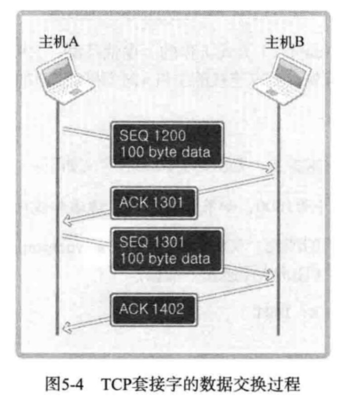
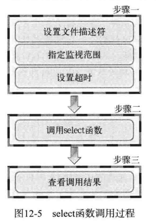

# 《TCP/IP 网络编程》学习笔记

ref: https://github.com/riba2534/TCP-IP-NetworkNote/tree/master

# CH1 理解网络编程和套接字

## 1.1 理解网络编程和套接字

### 1.1.1 构建网络套接字

以电话机打电话的方式来理解套接字。套接字是用来网络编程的工具，他就像是现实生活中的电话, 一个让两个进程（跨机器）进行交流的“电话”。

下面有几个基本的api

```c++
#include <sys/socket.h>

int socket(int domain, int type, int protocol)
// “买一个电话”，成功就返回文件描述符，失败时返回 -1

int bind(int sockfd, struct sockaddr *myaddr , sock)
// “给电话分配一个电话号码”， 成功时候返回 0 ， 失败时返回 -1

int listen(int sockfd, int backlog);
// "连上电话线，转成可接听状态", 成功时候返回 0 ， 失败时返回 -1


int accept(int sockfd, struct sockaddr *addr, socklen_t *addrlen);
// "电话响了，接电话" , 成功时返回文件描述符，失败时返回-1

```

网络编程中和接受连接请求的套接字创建过程可整理如下：

- 第一步：调用 socket 函数创建套接字。
- 第二步：调用 bind 函数分配IP地址和端口号。
- 第三步：调用 listen 函数转换为可接受请求状态。
- 第四步：调用 accept 函数受理套接字请求

### 1.1.2 编写`Hello World`套接字程序

下面会演示一个最简单的server和client，代码里很多细节书中会逐渐讲到，这里只需要
知道整个流程步骤。

- 服务端

服务器端（server）是能够受理连接请求的程序。下面构建服务端以验证之前提到的函数调用过程，该服务器端收到连接请求后向请求者返回Hello World!答复。除各种函数的调用顺序外，我们还未涉及任何实际编程。因此，阅读代码时请重点关注套接字相关的函数调用过程，不必理解全过程。

服务器端代码请参见：[hello_server.c](./ch01/hello_server.c)

- 客户端

客户端程序只有调用 socket 函数创建套接字 和 调用 connect 函数向服务端发送连接请求这两个步骤，下面给出客户端，需要查看以下两方面的内容：

调用 socket 函数 和 connect 函数
与服务端共同运行以收发字符串数据
客户端代码请参见：[hello_client.c](./ch01/hello_client.c)

## 1.2 基于Linux文件的操作

Linux 将 socket 视为文件。文件和套接字一般经过创建过程才会被分配文件描述符。 在上面的代码里 socket （整数类型） 就是一个文件描述符。
因此在网络数据传输层中，可以使用Linux I/O 相关函数。下面是一些基本的I/O操作api。

```c++
#include <sys/types.h>
#include <sys/stat.h>
#include <fcntl.h>

int open(const char* path, int flag);
/*
 return file describer when success
 path: string of file path
 flag: open mode

    O_CREAT : create file if necessary
    O_TRUNC : 删除所有数据
    O_APPEND: 在文件末尾追加数据
    O_RDONLY: 只读打开
    O_WRONLYL: 只写打开
    O_RDWR: 读写打开

/*

int close(int fd);
/*
 成功时返回 0， 失败时返回-1
 fd：要关闭的文件或套接字的文件描述符
*/


ssize_t write(int fd, const void *buf, size_t nbytes)
/*
 成功时返回写入的字节数，失败时返回 -1
 fd 显示数据传输对象的文件描述符
 buf 保存要传输数据的缓冲值地址
 nbytes 要传输数据的字节数
*/


ssize_t read(int fd, void *buf , size_t nbytes)
/*
 成功时返回接收的字节数，遇到文件结尾会返回0，失败返回 -1
 fd: 数据传输对象的文件描述符
 buf: 保存接收到的数据的缓冲地址值
 nbytes: 要接收数据的最大字节数
*/


```

现在尝试用这些api创建一个文件 data.txt ，并往里面写 "Hi,Charles", 代码见 [low_write.c](./ch01/low_open.c),
再尝试将文件读出来，代码见 [low_read.c](./ch01/low_read.c)

# CH2 套接字类型和协议设置

## 2.1 套接字协议和数据传输特性

### 2.1.1 创建套接字

```c++
#include <sys/socket.h>
int socket(int domain, int type, int protocol);
/*
成功时返回文件描述符，失败时返回-1
domain: 套接字中使用的协议族（Protocol Family）
type: 套接字数据传输的类型信息
protocol: 计算机间通信中使用的协议信息
*/
```

### 2.1.2 协议族（Protocol Family）

通过 socket 函数的第一个参数传递套接字中使用的协议分类信息。此协议分类信息称为协议族，可分成如下几类：

> 头文件 sys/socket.h 中声明的协议族

| 名称      | 协议族               |
| --------- | -------------------- |
| PF_INET   | IPV4 互联网协议族    |
| PF_INET6  | IPV6 互联网协议族    |
| PF_LOCAL  | 本地通信 Unix 协议族 |
| PF_PACKET | 底层套接字的协议族   |
| PF_IPX    | IPX Novel 协议族     |

本书着重讲 PF_INET 对应的 IPV4 互联网协议族。其他协议并不常用，或并未普及。
另外，套接字中采用的最终的协议信息是通过 socket 函数的第三个参数传递的。在指定的协议族范围内通过第一个参数决定第三个参数。

### 2.1.3 套接字类型（Type）

套接字类型指的是套接字的数据传输方式，由socket函数的第二个参数决定。决定了协议族并不能同时决定数据传输方式。换言之， socket 函数的第一个参数 PF_INET 协议族中也存在多种数据传输方式。

### 2.1.4 套接字类型1: 面向连接的套接字（SOCK_STREAM）

如果 socket 函数的第二个参数传递 `SOCK_STERAM`, 蒋桂创建面向连接的套接字。
它的传输方式特征如下：

- 传输过程中数据不会消失
- 按序传输数据
- 传输的数据不存在数据边界（Boundary）

这种情况适用于之前说的 write 和 read 函数

> 传输数据的计算机通过调用3次 write 函数传递了 100 字节的数据，但是接受数据的计算机仅仅通过调用 1 次 read 函数调用就接受了全部 100 个字节。

收发数据的套接字内部有缓冲（buffer），简言之就是字节数组。只要不超过数组容量，那么数据填满缓冲后过 1 次 read 函数的调用就可以读取全部，也有可能调用多次来完成读取。

> 套接字缓冲已满是否意味着数据丢失？

答：缓冲并不总是满的。如果读取速度比数据传入过来的速度慢，则缓冲可能被填满，但是这时也不会丢失数据，因为传输套接字此时会停止数据传输，所以面向连接的套接字不会发生数据丢失。
套接字联机必须一一对应。面向连接的套接字可总结为：
可靠地、按序传递的、基于字节的面向连接的数据传输方式的套接字。

### 2.1.5 面向消息的套接字 （SOCK_DGRAM)

如果 socket 函数的第二个参数传递 `SOCK_DGRAM` ,将创建面向消息的套接字。面向消息的套接字有以下特点。

- 强调快速传输而非传输有序
- 传输的数据可能丢失也可能损毁
- 传输的数据有边界
- 限制每次传输数据的大小

面向消息的套接字比面向连接的更具有传输速度，但可能丢失。特点可总结为：

不可靠的、不按序传递的、以数据的高速传输为目的套接字。

### 2.1.6 协议的最终选择

socket 函数的第三个参数决定最终采用的协议。本书用的是 Ipv4 的协议族，和面向连接的数据传输，满足这两个条件的协议只有 IPPROTO_TCP ，因此可以如下调用 socket 函数创建套接字，这种套接字称为 TCP 套接字。

```c++
int tcp_socket = socket(PF_INET, SOCK_STREAM, IPPROTO_TCP)
```

SOCK_DGRAM 指的是面向消息的数据传输方式，满足上述条件的协议只有 TPPROTO_UDP 。这种套接字称为 UDP 套接字：

```c++
int udp_socket = socket(PF_INET, SOCK_DGRAM, IPPROTO_UDP)
```

### 2.1.7 面向连接的套接字：TCP 套接字示例

需要对第一章的代码做出修改，修改好的代码如下。

- [tcp_server.c](./ch02/tcp_server.c)
- [tcp_client.c](./ch02/tcp_client.c)

# CH3 地址族和数据序列

把套接字比喻成电话，那么目前只安装了电话机，本章讲解给电话机分配号码的方法，即给套接字分配 IP 地址和端口号。

## 3.1 分配给套接字的ip地址和端口号

IP是Internet Protocol的缩写，是为了收发网络数据而分配给计算机的值。端口号是为了区分程序中创建的套接字给套接字的序号。

### 3.1.1 网络地址

为使计算机连接到网络并收发数据，必须为其分配 IP 地址。IP 地址分为两类。

IPV4（Internet Protocol version 4）4 字节地址族
IPV6（Internet Protocol version 6）16 字节地址族
两者之间的主要差别是 IP 地址所用的字节数，目前通用的是 IPV4 , IPV6 的普及还需要时间。

IPV4 标准的 4 字节 IP 地址分为网络地址和主机（指计算机）地址，且分为 A、B、C、D、E 等类型。（略）

| 类别    | 结构描述                     | 网络ID长度 | 主机ID长度 | 总长度 | 备注                                         |
| ------- | ---------------------------- | ---------- | ---------- | ------ | -------------------------------------------- |
| **A类** | `网络ID` + `主机ID`          | 1 字节     | 3 字节     | 4 字节 | 最高位为`0`，支持大型网络                    |
| **B类** | `网络ID` + `主机ID`          | 2 字节     | 2 字节     | 4 字节 | 最高位为`10`，适用于中型网络                 |
| **C类** | `网络ID` + `主机ID`          | 3 字节     | 1 字节     | 4 字节 | 最高位为`110`，适用于小型网络                |
| **D类** | `1110`（固定前缀）+ 组播地址 | 无         | 无         | 4 字节 | 最高位为`1110`，用于多播通信（28位组播地址） |

### 3.1.2 网络地址分类与主机地址边界

只需通过IP地址的第一个字节即可判断网络地址占用的总字节数，因为我们根据IP地址的边界区分网络地址，如下所示：

A 类地址的首字节范围为：0 ~ 127
B 类地址的首字节范围为：128 ~ 191
C 类地址的首字节范围为：192 ~ 223

### 3.1.3 用于区分套接字的端口号

IP地址用于区分计算机，只要有IP地址就能向目标主机传输数据，但是只有这些还不够，我们需要把信息传输给具体的应用程序。

所以计算机一般有 NIC（网络接口卡）数据传输设备。通过 NIC 接收的数据内有端口号，操作系统参考端口号把信息传给相应的应用程序。

端口号由 16 位构成，可分配的端口号范围是 065535 。但是 01023 是知名端口，一般分配给特定的应用程序，所以应当分配给此范围之外的值。

虽然端口号不能重复，但是 TCP 套接字和 UDP 套接字不会共用端口号，所以允许重复。如果某 TCP 套接字使用了 9190 端口号，其他 TCP 套接字就无法使用该端口号，但是 UDP 套接字可以使用。

总之，数据传输目标地址同时包含IP地址和端口号，只有这样，数据才会被传输到最终的目的应用程序。

## 3.2 地址的表示

应用程序中用结构体来存储端口和IP地址的相关信息。

### 3.2.1 表示 IPV4 的结构体

```c
struct sockaddr_in{
  sa_family_t sin_family; // Address Family
  uint16_t sin_port; // TCP/UDP port
  struct in_addr sin_addr; // 32 bit IP address
  char  sin_zero[8]; // not used
};

struct in_addr{
  in_addr_t s_addr; // 32 bin ip address
};
```

关于以上两个结构体的一些数据类型：

| 数据类型名称 | 数据类型说明             | 声明的头文件 |
| ------------ | ------------------------ | ------------ |
| sa_family_t  | 地址族（address family） | sys/socket.h |
| socklen_t    | 长度（length of struct） | sys/socket.h |
| in_addr_t    | IP地址，声明为 uint_32_t | netinet/in.h |
| in_port_t    | 端口号，声明为 uint_16_t | netinet/in.h |

### 3.2.2 结构体 sockaddr_in 的成员分析

struct sockaddr_in 成员

| 成员名     | 数据类型       | 字节大小 | 描述                                   |
| ---------- | -------------- | -------- | -------------------------------------- |
| sin_family | sa_family_t    | 2字节    | 地址族（如 AF_INET 或 AF_INET6）       |
| sin_port   | in_port_t      | 2字节    | 16位端口号，以网络字节序（大端序）保存 |
| sin_addr   | struct in_addr | 4字节    | 32位 IPv4 地址，以网络字节序保存       |
| sin_zero   | char           | 8字节    | 填充字段，无实际用途，通常置零         |

> 关于sin_zero的作用
> 在之前的代码中 sockaddr_in 变量的地址会被转成 sockaddr 结构体地址传进 bind 函数
>
> ```c
> // code in previous file
> if (bind(serv_sock, (struct sockaddr *)&serv_addr, sizeof(serv_addr)) == -1)
>    error_handling("bind() error");
>
> // define of sockaddr
> struct sockaddr
> {
>    sa_family_t sin_family; //地址族
>    char sa_data[14];       //地址信息
> }
>
> ```
>
> sin_zero 只是为了保证两种类型所占大小一样加的填充值。

## 3.3 网路字节序和地址变换

### 3.3.1 字节序（Order）与网络字节序

CPU 保存数据的方式有两种，这意味着 CPU 解析数据的方式也有 2 种：

- 大端序（Big Endian）：高位字节存放到低位地址
- 小端序（Little Endian）：高位字节存放到高位地址

网络字节序（Network Byte Order），非常简单，统一为大端序。即，先把数据数组转化成大端序格式再进行网络传输。

### 3.3.2 字节序转换

帮助转换字节序的函数：

```c
/*
htons 的 h 代表主机（host）字节序。
htons 的 n 代表网络（network）字节序。
s 代表两个字节的 short 类型，因此以 s 为后缀的函数用于端口转换
l 代表四个字节的 long 类型，所以以 l 为后缀的函数用于 IP 地址转换
*/

unsigned short htons(unsigned short);
unsigned short ntohs(unsigned short);
unsigned long htonl(unsigned long);
unsigned long ntohl(unsigned long);
```

函数调用示例见 [endian_conv.c](./ch03/endian_conv.c)

## 3.4 网络地址的初始化和分配

### 3.4.1 将字符串信息转换为网络字节序的整数型

一个函数将字符串信息转换为网络字节序的整数型

```c
#include <arpa/inet.h>
in_addr_t inet_addr(const char *string);
//成功时返回 32 位大端序整数型值，失败时返回 INADDR_NONE

```

inet_addr 不仅可以转换地址，还可以检测有效性。
函数调用示例见 [inet_addr.c](./ch03/inet_addr.c)

inet_aton 函数与 inet_addr 函数在功能上完全相同，也是将字符串形式的IP地址转换成整数型的IP地址。
只不过该函数会直接将结果保存到 in_addr 结构体。

```c
#include <arpa/inet.h>

int inet_aton(const char* string, struct in_addr *addr);
/*
成功时返回 1 ，失败时返回 0
string: 含有需要转换的IP地址信息的字符串地址值
addr: 保存转换结果的 in_addr 结构体变量的地址值
*/
```

函数调用示例见 [inet_aton.c](./ch03/inet_aton.c)

还有一个函数，与 inet_aton() 正好相反，它可以把网络字节序整数型IP地址转换成我们熟悉的字符串形式，函数原型如下：

```c

#include <arpa/inet.h>
char *inet_ntoa(struct in_addr adr);
//成功时返回保存转换结果的字符串地址值，失败时返回 NULL 空指针

```

函数调用示例见 [inet_ntoa.c](./ch03/inet_aton.c)

### 3.4.2 网络地址初始化

结合前面的内容，介绍套接字创建过程中，常见的网络信息初始化方法：

```c
struct sockaddr_in addr;
char *serv_ip = "211.217,168.13";          //声明IP地址族
char *serv_port = "9190";                  //声明端口号字符串
memset(&addr, 0, sizeof(addr));            //结构体变量 addr 的所有成员初始化为0
addr.sin_family = AF_INET;                 //制定地址族
addr.sin_addr.s_addr = inet_addr(serv_ip); //基于字符串的IP地址初始化
addr.sin_port = htons(atoi(serv_port));    //基于字符串的IP地址端口号初始化
```

# CH4 基于 TCP 的服务端/客户端

## 4.1 理解 TCP 和 UDP

根据数据传输方式的不同，基于网络协议的套接字一般分为 TCP 套接字和 UDP 套接字。因为 TCP 套接字是面向连接的，因此又被称为基于流（stream）的套接字。

TCP 是 Transmission Control Protocol （传输控制协议）的简写，意为「对数据传输过程的控制」。因此，学习控制方法及范围有助于正确理解 TCP 套接字。

### 4.1.1 TCP/IP 协议栈

TCP/IP 协议栈共分为 4 层，可以理解为数据收发分成了 4 个层次化过程，TCP/IP 协议栈共分为 4 层，可以理解为数据收发分成了 4 个层次化过程，通过层次化的方式来解决问题通过层次化的方式来解决问题

从下到上依次是

链路层 -> IP层 -> TCP层/UDP层 -> 应用层

### 4.1.2 链路层

链路层是物理链接领域标准化的结果，也是最基本的领域，专门定义LAN、WAN、MAN等网络标准。若两台主机通过网络进行数据交换，则需要物理连接，链路层就负责这些标准。

### 4.1.3 IP层

准备好物理连接后就要传输数据。为了在复杂网络中传输数据，首先要考虑路径的选择。向目标传输数据需要经过哪条路径？解决此问题的就是IP层，该层使用的协议就是IP。

IP 是面向消息的、不可靠的协议。每次传输数据时会帮我们选择路径，但并不一致。如果传输过程中发生错误，则选择其他路径，但是如果发生数据丢失或错误，则无法解决。换言之，IP协议无法应对数据错误。

### 4.1.4 TCP/UDP层

IP 层解决数据传输中的路径选择问题，只需照此路径传输数据即可。TCP 和 UDP 层以 IP 层提供的路径信息为基础完成实际的数据传输，故该层又称为传输层。

UDP 比 TCP 简单，现在我们只解释 TCP 。 TCP 可以保证数据的可靠传输，但是它发送数据时以 IP 层为基础（这也是协议栈层次化的原因）。

IP 层只关注一个数据包（数据传输基本单位）的传输过程。

因此，如果要传输多个数据包，这些数据包的传输顺序及传输是否丢失都是不保证的。若只利用IP层传输数据，则可能导致后传输的数据包B比先传输的数据包A提早到达。另外，传输的数据包A、B、C中可能只收到A和C，甚至收到的C可能已经损毁 。反之，若添加 TCP 协议则按照如下对话方式进行数据交换。

> 主机A：正确接受第二个数据包
>
> 主机B：恩，知道了
>
> 主机A：正确收到第三个数据包
>
> 主机B：可我已经发送第四个数据包了啊！哦，您没收到吧，我给你重新发。

这就是 TCP 的作用。如果交换数据的过程中可以确认对方已经收到数据，并重传丢失的数据，那么即便IP层不保证数据传输，这类通信也是可靠的。

### 4.1.5 应用层

从编程者的角度，链路层，IP层，传输层的事情都不需要关注，这些都是套接字通信过程中自动处理的。

选择数据传输路径、数据确认过程都被隐藏到套接字内部。

程序员只需要利用套接字编出程序即可。编写软件的过程中，需要根据程序的特点来决定服务器和客户端之间的数据传输规则，这便是应用层协议。

## 4.2 实现基于 TCP 的服务器/客户端

### 4.2.1 TCP 服务器的默认函数的调用顺序

顺序步骤

- `socket()` 创建套接字
- `bind()` 分配套接字 ip
- `listen()` 等待请求连接
- `accept()` 允许连接
- `read()/write()` 数据交换
- `close()` 断开连接

### 4.2.2 进入等待请求状态

调用 socket 函数创建套接字，声明并初始化地址信息的结构体变量，调用 bind 函数向套接字分配地址。
已经调用了 bind 函数给套接字分配地址，接下来就是要通过调用 listen 函数进入等待链接请求状态。

只有调用了 listen 函数，客户端才能进入可发出连接请求的状态。

客户端可以调用 connect 函数，向服务端请求连接，对于客户端发来的请求，先进入连接请求等待队列，等待服务端受理请求。

```c
#include <sys/socket.h>
int listen(int sockfd, int backlog);
//成功时返回0，失败时返回-1
//sock: 希望进入等待连接请求状态的套接字文件描述符，传递的描述符套接字参数称为服务端套接字
//backlog: 连接请求等待队列的长度，若为5，则队列长度为5，表示最多使5个连接请求进入队列
```

### 4.2.3 受理客户端连接请求

调用 listen 函数后，套接字应该按序受理客户端发起的连接请求。

受理请求就是服务端处理一个连接请求，进入可接受客户端数据的状态。

进入这种状态所需的部件是套接字，但是此时使用的不是服务端套接字，此时需要另一个套接字，但是没必要亲自创建，下面的函数将自动创建套接字。

```c
#include <sys/socket.h>
int accept(int sockfd, struct sockaddr *addr, socklen_t *addrlen);
/*
成功时返回文件描述符，失败时返回-1
sock: 服务端套接字的文件描述符
addr: 受理的请求中，客户端地址信息会保存到该指针指向的地址
addrlen: 该指针指向的地址中保存第二个参数的结构体长度
*/
```

accept 函数受理连接请求队列中待处理的客户端连接请求。函数调用成功后，accept 内部将产生用于数据 I/O 的套接字，并返回其文件描述符。需要强调的是套接字是自动创建的，并自动与发起连接请求的客户端建立连接。

注意：accept 函数返回的套接字不等于服务端套接字，也需要通过 close 函数关闭。

### 4.2.4 回顾 Hello World 服务端

代码 ： [hello_server.c](./ch01/hello_server.c)

1.服务端实现过程中首先要创建套接字，此时的套接字并非是真正的服务端套接字

2.为了完成套接字地址的分配，初始化结构体变量并调用 bind 函数。

3.调用 listen 函数进入等待连接请求状态。连接请求状态队列的长度设置为5.此时的套接字才是服务端套接字。

4.调用 accept 函数从队头取 1 个连接请求与客户端建立连接，并返回创建的套接字文件描述符。另外，调用 accept 函数时若等待队列为空，则 accept 函数不会返回，直到队列中出现新的客户端连接。

5.调用 write 函数向客户端传送数据，调用 close 关闭连接

### 4.2.5 TCP 客户端的默认函数调用顺序

顺序步骤

- `socket()` 创建套接字
- `connect()` 请求连接
- `read()/write()` 交换数据
- `close()` 断开连接

与服务端相比，区别就在于「请求连接」，它是创建客户端套接字后向服务端发起的连接请求。

```c
#include <sys/socket.h>
int connect(int sock, struct sockaddr *servaddr, socklen_t addrlen);
/*
成功时返回0，失败返回-1
sock:客户端套接字文件描述符
servaddr: 保存目标服务器端地址信息的变量地址值
addrlen: 第二个结构体参数 servaddr 变量的字节长度
*/

```

客户端调用 connect 函数后，发生以下函数之一才会返回（完成函数调用）:

- 服务端接受连接请求
- 发生断网等异常状况而中断连接请求

> 注意：接受连接不代表服务端调用 accept 函数客户端在调用connect函数时自动分配主机的IP，随机分配端口。
> 无需调用标记的bind函数进行分配。，其实只是服务器端把连接请求信息记录到等待队列。
> 因此 connect 函数返回后并不应该立即进行数据交换。

### 4.2.6 回顾 Hello World 客户端

代码：[hello_client.c](./ch01/hello_client.c)

1.创建准备连接服务器的套接字，此时创建的是 TCP 套接字

2.结构体变量 serv_addr 中初始化IP和端口信息。初始化值为目标服务器端套接字的IP和端口信息。

3.调用 connect 函数向服务端发起连接请求

4.完成连接后，接收服务端传输的数据

5.接收数据后调用 close 函数关闭套接字，结束与服务器端的连接。(对套接字调用close函数，对应于向建立连接的对应套接字发送EOF。即，如果客户端的套接字调用了close函数，服务端read时候会返回0。)

### 4.2.7 基于 TCP 的服务端/客户端函数调用关系

关系图如下所示：


- 客户端只能等到服务端调用 listen 函数后才才能调用 connect 函数

- 服务器端可能会在客户端调用 connect 之前调用 accept 函数，这时服务器端进入阻塞（blocking）状态，直到客户端调用 connect 函数后接收到连接请求。

## 4.3 实现迭代服务器/客户端 (echo server)

编写一个回声（echo）服务器/客户端。

顾名思义，服务端将客户端传输的字符串数据原封不动的传回客户端，就像回声一样。

### 4.3.1 实现迭代服务器端

在 Hello World 的例子中，server 只接收了一个请求, 然后就关闭了整个server。

如果想继续处理好后面的客户端请求应该怎样扩展代码？

最简单的方式就是插入循环反复调用 accept 函数，如图:


可以看出，调用 accept 函数后，紧接着调用 I/O 相关的 read write 函数，然后调用 close 函数。这并非针对服务器套接字，而是针对 accept 函数调用时创建的套接字。

### 4.3.2 迭代回声服务器端/客户端

程序运行的基本方式：

- 服务器端在同一时刻只与一个客户端相连，并提供回声服务。
- 服务器端依次向 5 个客户端提供服务并退出。
- 客户端接受用户输入的字符串并发送到服务器端。
- 服务器端将接受的字符串数据传回客户端，即「回声」
- 服务器端与客户端之间的字符串回声一直执行到客户端输入 Q 为止。

以下是服务端与客户端的代码：

- [echo_server.c](./ch04/echo_server.c)
- [echo_client.c](./ch04/echo_client.c)

### 4.3.3 回声客户端存在的问题 （重点：理解这个问题来源

以上客户端代码有一个假设「每次调用 read、write函数时都会以字符串为单位执行实际 I/O 操作」

但是「第二章」中说过「TCP 不存在数据边界」，上述客户端是基于 TCP 的，因此多次调用 write 函数传递的字符串有可能一次性传递到服务端。此时客户端有可能从服务端收到多个字符串，这不是我们想要的结果。还需要考虑服务器的如下情况：

「字符串太长，需要分 2 个包发送！」

服务端希望通过调用 1 次 write 函数传输数据，但是如果数据太大，操作系统就有可能把数据分成多个数据包发送到客户端。另外，在此过程中，客户端可能在尚未收到全部数据包时就调用 read 函数。

以上的问题都是源自 TCP 的传输特性，解决方法在第 5 章。

# CH5 基于 TCP 的服务端/客户端 (2)

上一章仅仅是从编程角度学习实现方法，并未详细讨论 TCP 的工作原理。因此，本章将想次讲解 TCP 中必要的理论知识，还将给出第 4 章客户端问题的解决方案。

## 5.1 echo 客户端的实现

### 5.1.1 改进 echo 客户端

第四章的echo server/clent中，server的IO代码逻辑是合理的，但是client部分就有问题。

先回顾一下服务器端的I/O相关代码

```c
// 这个 while 循环会在 client 侧调用 close() 才会跳出
// 也就是说 server 可以保证接收到 client 发来的所有信息
while((str_len = read(clnt_sock, message, BUF_SIZE)) != 0 )
  write(clnt_sock, message, str_len);
```

接着回顾 客户端的I/O 的相关代码

```c
while (1)
{
    fputs("Input Message(q/Q to quit): ", stdout);
    fgets(message, BUF_SIZE, stdin);
    if(! strcmp(message, "q\n") || ! strcmp(message, "Q\n"))
        break;
    write(sock, message, strlen(message));
    str_len = read(sock, message, BUF_SIZE);
    message [str_len] = 0;
    printf("Message from server: %s\n", message);
}
```

这里的client假设所有发出去的message都能马上通过 read 函数读取出来。实际上前面提过
用TCP传输的数据是没有边界的，那么这里实际上读到的数据也不保证就是是发出去的所有数据，
因此最后调用打印出来的log也可能是不完整的message。

### 5.1.2 升级 echo 客户端

因为提前知道了需要接收的数据的大小，所以可以像下面这样改进client的代码。

```c
while (1)
{
    fputs("Input Message(q/Q to quit): ", stdout);
    fgets(message, BUF_SIZE, stdin);
    if(! strcmp(message, "q\n") || ! strcmp(message, "Q\n"))
        break;
-   write(sock, message, strlen(message));
-   str_len = read(sock, message, BUF_SIZE);
+   str_len = write(sock, message, strlen(message));
+   recv_len = 0;
+   while(recv_len < str_len){
+     recv_cnt = read(sock, &message[recv_len], BUF_SIZE - 1);
+     if (recv_cnt == -1){
+       error_handling("read() error")
+     }
+     recv_len += recv_cnt;
+
+   }
    message [str_len] = 0;
    printf("Message from server: %s\n", message);
}

```

### 5.1.3 定义应用层协议

echo 客户端可以提前知道接收数据的长度，这在大多数情况下是不可能的。
那么此时无法预知接收数据长度时应该如何收发数据？
这时需要的是应用层协议的定义。在收发过程中定好规则（协议）以表示数据边界，
或者提前告知需要发送的数据的大小。

服务端/客户端实现过程中逐步定义的规则集合就是应用层协议。

现在写一个小程序来体验应用层协议的定义过程。要求：

1. 服务器从客户端获得多个数组和运算符信息。
2. 服务器接收到数字候对齐进行加减乘运算，然后把结果传回客户端。
   > 例：
   > 向服务器传递"3,5,9|+"的同事请求加法运算，服务器返回3+5+9的结果
   > 传递"3,5,9|*"，客户端会收到3*5\*9的结果
   > 请自己实现一个程序来实现功能。

示例代码: [op_client.c](./ch05/op_client.c) , [op_server.c](./ch05/op_server.c)

## 5.2 TCP 的原理

### 5.2.1 TCP 套接字中的 I/O 缓冲

TCP套接字的数据收发无边界。服务器即使调用一次write函数传输40字节的数据，客户端也可能通过4次read函数调用每次
读取 10 字节。

但此处也有一些疑问，服务器一次性传输了 40 字节，而客户端竟然可以缓慢的分批接受。客户端接受 10 字节后，剩下的 30 字节在何处等候呢？

实际上，write 函数调用后并非立即传输数据， read 函数调用后也并非马上接收数据。

如图所示，write 函数调用瞬间，数据将移至输出缓冲；read 函数调用瞬间，从输入缓冲读取数据。


I/O 缓冲特点如下:

- I/O 缓冲在每个TCP套接字中单独存在
- I/O 缓冲在创建套接字时候自动生成
- 关闭套接字也会继续传递输出缓冲中遗留的数据
- 不安比套接字将会丢失输入缓冲中的数据

假设发生以下情况，会发生什么事呢？

客户端输入缓冲为 50 字节，而服务器端传输了 100 字节。

因为 TCP 不会发生超过输入缓冲大小的数据传输。也就是说，根本不会发生这类问题，因为 TCP 会控制数据流。
TCP 中有滑动窗口（Sliding Window）协议，用对话方式如下：

> A：你好，最多可以向我传递 50 字节
> B：好的
> A：我腾出了 20 字节的空间，最多可以接受 70 字节
> B：好的
> 数据收发也是如此，因此 TCP 中不会因为缓冲溢出而丢失数据。

write 函数在数据传输完成时返回。

### 5.2.2 TCP 内部工作原理: 与对方套接字连接

TCP 套接字与对方套接字建立连接的过程。连接过程中，套接字的对话如下：

- 套接字A：你好，套接字 B。我这里有数据给你，建立连接吧
- 套接字B：好的，我这边已就绪
- 套接字A：谢谢你受理我的请求

TCP 在实际通信中也会经过三次对话过程，因此，该过程又被称为 Three-way handshaking（三次握手）。
接下来给出连接过程中实际交换的信息方式：


套接字是全双工方式工作的。也就是说，它可以双向传递数据。因此，收发数据前要做一些准备。

首先请求连接的主机 A 要给主机 B 传递以下信息：

> [SYN] SEQ: 1000, ACK: -

> SEQ为1000的含义是: 现在传递的数据包的序号为 1000，如果接收无误，请通知我向您传递 1001 号数据包。
> 这是首次连接时使用的消息，又称为 SYN

接下来主机 B 向 A 传递以下信息：

> [SYN + ACK] SEQ: 2000 , ACK: 1001
> SEQ为2000的含义是：现传递的数据包的序号为 2000 ，如果接受无误，请通知我向您传递 2001 号数据包
> ACK 1001 的含义是：刚才传输的 SEQ 为 1000 的数据包接受无误，现在请传递 SEQ 为 1001 的数据包

这份消息既发送了 对于主机 A 首次传输的数据包的确认消息（ACK 1001），又发送了为主机 B 传输数据做准备的同步消息（SEQ 2000）
这种消息叫 SYN+ACK

最后 主机A给主机B 发

> [ACK] SEQ: 1001 , ACK: 2001

### 5.2.3 TCP 内部工作原理2：与对方主机做数据交换

通过第一步三次握手过程完成了数据交换准备，下面就开始正式收发数据，其默认方式如图所示：



图上给出了主机 A 分成 2 个数据包向主机 B 传输 200 字节的过程。

首先，主机 A 通过 1 个数据包发送 100 个字节的数据，数据包的 SEQ 为 1200 。

主机 B 为了确认这一点，向主机 A 发送 ACK 1301 消息。

此时的 ACK 号为 1301 而不是 1201，原因在于 ACK 号的增量为传输的数据字节数。

假设每次 ACK 号不加传输的字节数，这样虽然可以确认数据包的传输，但无法明确 100 个字节全都正确传递还是丢失了一部分，比如只传递了 80 字节。

因此按照如下公式传递 ACK 信息：

> ACK 号 = SEQ 号 + 传递的字节数 + 1

与三次握手协议相同，最后 + 1 是为了告知对方下次要传递的 SEQ 号。

下面分析传输过程中数据包丢失的情况：


上图表示了通过 SEQ 1301 数据包向主机 B 传递 100 字节数据。但中间发生了错误，主机 B 未收到，经过一段时间后，主机 A 仍然未收到对于 SEQ 1301 的 ACK 的确认，因此试着重传该数据包。为了完成该数据包的重传，TCP 套接字启动计时器以等待 ACK 应答。若相应计时器发生超时（Time-out!）则重传

### 5.2.4 TCP 内部工作原理3： 断开套接字的连接

TCP 套接字的结束过程也非常优雅。如果对方还有数据需要传输时直接断掉该连接会出问题，所以断开连接时需要双方协商，断开连接时双方的对话如下：

> 套接字A：我希望断开连接
> 套接字B：哦，是吗？请稍后。
> 套接字A：我也准备就绪，可以断开连接。
> 套接字B：好的，谢谢合作。


图中数据包内的 FIN 表示断开连接。也就是说，双方各发送 1 次 FIN 消息后断开连接。

此过过程经历 4 个阶段，因此又称四次挥手（Four-way handshaking）。

SEQ 和 ACK 的含义与之前讲解的内容一致，省略。

图中，主机 A 传递了两次 ACK 5001，也许这里会有困惑。

其实，第二次 FIN 数据包中的 ACK 5001 只是因为接收了 ACK 消息后未接收到的数据重传的。

# CH6 基于UDP的服务端/客户端

TCP 是内容较多的一个协议，而本章中的 UDP 内容较少，但是也很重要。

## 6.1 理解UDP

通过寄信来说明 UDP 的工作原理，这是讲解 UDP 时使用的传统示例，它与 UDP 的特点完全相同。

寄信前应先在信封上填好寄信人和收信人的地址，之后贴上邮票放进邮筒即可。

当然，信件的特点使我们无法确认信件是否被收到。邮寄过程中也可能发生信件丢失的情况。

也就是说，信件是一种不可靠的传输方式，UDP 也是一种不可靠的数据传输方式。

因为 UDP 没有 TCP 那么复杂，所以编程难度比较小，性能也比 TCP 高。

在更重视性能的情况下可以选择 UDP 的传输方式。

TCP 与 UDP 的区别很大一部分来源于流控制。也就是说 TCP 的生命在于流控制。

### 6.1.2 UDP 工作原理

IP 的作用就是让离开主机 B 的 UDP 数据包准确传递到主机 A 。

但是把 UDP 数据包最终交给主机 A 的某一 UDP 套接字的过程是由 UDP 完成的。

UDP 的最重要的作用就是根据端口号将传到主机的数据包交付给最终的 UDP 套接字。

### 6.1.3 UDP 的高效使用

UDP 也具有一定的可靠性。对于通过网络实时传递的视频或者音频时情况有所不同。

对于多媒体数据而言，丢失一部分数据也没有太大问题，这只是会暂时引起画面抖动，或者出现细微的杂音。

但是要提供实时服务，速度就成为了一个很重要的因素。

因此流控制就显得有一点多余，这时就要考虑使用 UDP 。TCP 比 UDP 慢的原因主要有以下两点：

- 收发数据前后进行的连接设置及清除过程。
- 收发过程中为保证可靠性而添加的流控制。

如果收发的数据量小但是需要频繁连接时，UDP 比 TCP 更高效。

## 6.2 实现基于 UDP 的服务端/客户端

### 6.2.1 UDP中的服务段和客户端没有连接

UDP套接字的交互 中只有创建套接字和数据交换的过程。

### 6.2.2 UDP 服务器和客户端均只需一个套接字

TCP 中，套接字之间应该是一对一的关系。

在 UDP 中，不管是服务器端还是客户端都只需要 1 个套接字。

只需要一个 UDP 套接字就可以向任意主机传输数据，如图所示：


> 图中展示了 1 个 UDP 套接字与 2 个不同主机交换数据的过程。也就是说，只需 1 个 UDP 套接字就能和多台主机进行通信。

### 6.2.3 基于UDP的数据I/O函数

因为 UDP 套接字不会保持连接状态（UDP 套接字只有简单的邮筒功能），因此每次传输数据时都需要添加目标的地址信息。

这相当于寄信前在信件中填写地址。接下来是 UDP 的相关函数：

```c
#include <sys/socket.h>
ssize_t sendto(int sock, void *buff, size_t nbytes, int flags, struct sockaddr *to,
                socklen_t addrlen);

/*
成功时返回发送的字节数，失败时返回 -1
sock: 用于传输数据的 UDP 套接字
buff: 保存待传输数据的缓冲地址值
nbytes: 待传输的数据长度，以字节为单位
flags: 可选项参数，若没有则传递 0
to: 存有目标地址的 sockaddr 结构体变量的地址值
addrlen: 传递给参数 to 的地址值结构体变量长度

*/

ssize_t recvfrom(int sock, void *buff, size_t nbytes, int flags,
                 struct sockaddr *from, socklen_t *addrlen);

/*
成功时返回接收的字节数，失败时返回 -1
sock: 用于传输数据的 UDP 套接字
buff: 保存待传输数据的缓冲地址值

nbytes: 待传输的数据长度，以字节为单位
flags: 可选项参数，若没有则传递 0
from: 存有发送端地址信息的 sockaddr 结构体变量的地址值
addrlen: 保存参数 from 的结构体变量长度的变量地址值。
*/
```

### 6.2.4 基于 UDP 的回声服务器端/客户端

下面是实现的基于 UDP 的回声服务器的服务器端和客户端：

代码：

- [uecho_client.c](./ch06/uecho_server.c)
- [uecho_server.c](./ch06/uecho_client.c)

### 6.2.5 UDP 客户端 的 套接字的 地址分配

上面的 UDP 客户端可以发现，UDP 客户端缺少了把IP和端口分配给套接字的过程。

在 TCP 客户端调用 connect 函数自动完成此过程，而 UDP 中连能承担相同功能的函数调用语句都没有。

UDP 程序中，调用 sendto 函数传输数据前应该完成对套接字的地址分配工作，因此调用 bind 函数。bind 函数不区分 TCP 和 UDP。

另外，如果调用 sendto 函数尚未分配地址信息，则在首次调用 sendto 函数时给相应套接字自动分配 IP 和端口( IP 用主机IP，端口号用未选用的任意端口号 )。

而且此时分配的地址一直保留到程序结束为止，因此也可以用来和其他 UDP 套接字进行数据交换。

## 6.3 UDP的数据传输特性和调用 connect 函数

### 6.3.1 存在数据边界的 UDP 套接字

前面说得 TCP 数据传输中不存在数据边界，这表示「数据传输过程中调用 I/O 函数的次数不具有任何意义」

相反，UDP 是具有数据边界，传输中调用 I/O 函数的次数非常重要。

此，输入函数的调用次数和输出函数的调用次数应该完全一致，这样才能保证接收全部已经发送的数据。

例如，调用 3 次输出函数发送的数据必须通过调用 3 次输入函数才能接收完。

可以通过下面的例子验证：

- [bound_host1.c](./ch06/bound_host1.c)
- [bound_host2.c](./ch06/bound_host2.c)

host1 是服务端，host2 是客户端，host2 一次性把数据发给服务端后，结束程序。但是因为服务端每隔五秒才接收一次，所以服务端每隔五秒接收一次消息。

### 6.3.2 已连接（connect）UDP 套接字与未连接（unconnected）UDP 套接字

TCP 套接字中需注册待传传输数据的目标IP和端口号，而在 UDP 中无需注册。因此通过 sendto 函数传输数据的过程大概可以分为以下 3 个阶段：

- 第 1 阶段：向 UDP 套接字注册目标 IP 和端口号
- 第 2 阶段：传输数据
- 第 3 阶段：删除 UDP 套接字中注册的目标地址信息。

每次调用 sendto 函数时重复上述过程。每次都变更目标地址，因此可以重复利用同一 UDP 套接字向不同目标传递数据。

这种未注册目标地址信息的套接字称为未连接套接字，反之，注册了目标地址的套接字称为连接 connected 套接字。

显然，UDP 套接字默认属于未连接套接字。当一台主机向另一台主机传输很多信息时，

上述的三个阶段中，第一个阶段和第三个阶段占整个通信过程中近三分之一的时间，缩短这部分的时间将会大大提高整体性能。

### 6.3.3 创建已连接 UDP 套接字

创建已连接 UDP 套接字过程格外简单，只需针对 UDP 套接字调用 connect 函数。

```c
sock = socket(PF_INET, SOCK_DGRAM, 0);
memset(&adr, 0, sizeof(adr));
adr.sin_family = AF_INET;
adr.sin_addr.s_addr = inet_addr(argv[1]);
adr.sin_port = htons(atoi(argv[2]));
connect(sock, (struct sockaddr *)&adr, sizeof(adr));
```

之后就与 TCP 套接字一致，每次调用 sendto 函数时只需传递信息数据。

因为已经指定了收发对象，所以不仅可以使用 sendto、recvfrom 函数，还可以使用 write、read 函数进行通信。

下面是一个使用 已连接UDP 套接字的程序

[uecho_con_client.c](./ch06/uecho_con_client.c)

# CH7 断开套接字连接

本章讨论如何合理地断开套接字的连接，

之前用的方法不够优雅是因为，

我们是调用 close 函数或 closesocket 函数单方面断开连接的。

## 7.1 基于 TCP 的半关闭

TCP 的断开连接过程比建立连接更重要，因为连接过程中一般不会出现大问题，但是断开过程可能发生预想不到的情况。

因此应该准确掌控。所以要掌握半关闭（Half-close），才能明确断开过程。

### 7.1.1 单方面断开连接带来的问题

Linux 和 Windows 的 closesocket 函数意味着完全断开连接。完全断开不仅无法传输数据，
而且也不能接收数据。

因此在某些情况下，通信一方单方面的断开套接字连接，显得不太优雅。如图所示：


图中描述的是 2 台主机正在进行双向通信，主机 A 发送完最后的数据后，调用 close 函数断开了最后的连接，

之后主机 A 无法再接受主机 B 传输的数据。

实际上，是完全无法调用与接受数据相关的函数。最终，由主机 B 传输的、主机 A 必须要接受的数据也销毁了。

为了解决这类问题，「只关闭一部分数据交换中使用的流」的方法应运而生。

断开一部分连接是指，可以传输数据但是无法接收，或可以接受数据但无法传输。顾名思义就是只关闭流的一半。

### 7.1.2 套接字和流（stream）

两台主机通过套接字建立连接后进入可交换数据的状态，又称「流形成的状态」。

一旦两台主机之间建立了套接字连接，每个主机就会拥有单独的输入流和输出流。

当然，其中一个主机的输入流与另一个主机的输出流相连，而输出流则与另一个主机的输入流相连。

另外，本章讨论的「优雅的断开连接方式」只断开其中 1 个流，而非同时断开两个流。


### 7.1.3 断开单向流的 shutdown 函数

```c
#include <sys/socket.h>
int shutdown(int sock, int howto);
/*
成功时返回 0 ，失败时返回 -1
sock: 需要断开套接字文件描述符
howto: 传递断开方式信息
*/
```

调用上述函数时，第二个参数决定断开连接的方式，其值如下所示：

- SHUT_RD : 断开输入流
  > 中断输入流，套接字无法接收数据。即使输入缓冲收到数据也会抹去，而且无法调用相关函数。
- SHUT_WR : 断开输出流
  > 中断输出流，也就无法传输数据。若如果输出缓冲中还有未传输的数据，则将传递给目标主机。
- SHUT_RDWR : 同时断开 I/O 流
  > 同时中断 I/O 流。这相当于分 2 次调用 shutdown ，其中一次以SHUT_RD为参数，另一次以SHUT_WR为参数。

### 7.1.4 为何要半关闭

略

### 7.1.5 基于半关闭的文件传输程序

上述文件传输服务器端和客户端的数据流可以整理如图：


下面的代码为编程简便，省略了大量错误处理代码。

[file_client.c](./ch07/file_client.c)
[file_server.c](./ch07/file_server.c)

客户端接受完成后，服务器会接收到来自客户端的感谢信息。

# CH8 域名及网络地址

## 8.1 域名系统

DNS 是对IP地址和域名进行相互转换的系统，其核心是 DNS 服务器

### 8.1.1 什么是域名

域名就是我们常常在地址栏里面输入的地址，将比较难记忆的IP地址变成人类容易理解的信息。

### 8.1.2 DNS 服务器

相当于一个字典，可以查询出某一个域名对应的IP地址

## 8.2 IP地址和域名之间的转换

### 8.2.1 程序中有必要使用域名吗？

略

### 8.2.2 利用域名获取IP地址

使用以下函数可以通过传递字符串格式的域名获取IP地址

```c
#include <netdb.h>
struct hostent *gethostbyname(const char *hostname);
/*
成功时返回 hostent 结构体地址，失败时返回 NULL 指针
*/
```

这个函数使用方便，只要传递字符串，就可以返回域名对应的IP地址。

只是返回时，地址信息装入 hostent 结构体。

此结构体的定义如下：

```c
struct hostent
{
    char *h_name;       /* Official name of host.  */
    char **h_aliases;   /* Alias list.  */
    int h_addrtype;     /* Host address type.  */
    int h_length;       /* Length of address.  */
    char **h_addr_list; /* List of addresses from name server.  */
};
```

- h_name：
  - 该变量中存有官方域名（Official domain name）。
  - 官方域名代表某一主页，但实际上，一些著名公司的域名并没有用官方域名注册。
- h_aliases：
  - 可以通过多个域名访问同一主页。同一IP可以绑定多个域名，因此，除官方域名外还可以指定其他域名。
- h_addrtype：
  - gethostbyname 函数不仅支持 IPV4 还支持 IPV6 。
  - 因此可以通过此变量获取保存在 h_addr_list 的IP地址族信息。
  - 若是 IPV4 ，则此变量中存有 AF_INET。
- h_length：
  - 保存IP地址长度。若是 IPV4 地址，因为是 4 个字节，则保存4；
  - IPV6 时，因为是 16 个字节，故保存 16
- h_addr_list：
  - 此变量以整数形式保存域名相对应的IP地址。
  - 另外，用户比较多的网站有可能分配多个IP地址给同一个域名，利用多个服务器做负载均衡
  - 这是个指针数组，数组元素是指向 struct in_addr 类型的char\*指针

下面的代码通过一个例子来演示 gethostbyname 的应用，并说明 hostent 结构体变量特性。

- [gethostbyname.c](./ch08/gethostbyname.c)

仔细阅读这一段代码：

```c
inet_ntoa(*(struct in_addr *)host->h_addr_list[i])
```

若只看 hostent 的定义，结构体成员 h_addr_list 指向字符串指针数组（由多个字符串地址构成的数组）。
但是字符串指针数组保存的元素实际指向的是 in_addr 结构体变量中地址值而非字符串，
也就是说(struct in_addr *)host->h_addr_list[i]其实是一个指针，然后用*符号取具体的值。

### 8.2.3 利用ip地址获取域名

请看下面的函数定义：

```c
#include <netdb.h>
struct hostent *gethostbyaddr(const char *addr, socklen_t len, int family);
/*
成功时返回 hostent 结构体变量地址值，失败时返回 NULL 指针
addr: 含有IP地址信息的 in_addr 结构体指针。为了同时传递 IPV4 地址之外的全部信息，该变量的类型声明为 char 指针
len: 向第一个参数传递的地址信息的字节数，IPV4时为 4 ，IPV6 时为16.
family: 传递地址族信息，ipv4 是 AF_INET ，IPV6是 AF_INET6
*/
```

示例代码

- [gethostbyaddr.c](./ch08/gethostbyaddr.c)

# CH9 套接字的多种可选项

## 9.1 套接字的可选项和I/O缓冲大小

### 9.1.1 套接字多种可选项

我们之前写得程序都是创建好套接字之后直接使用的，此时通过默认的套接字特性进行数据通信，
这里列出了一些套接字可选项。

| 协议层      | 选项名            | 读取 | 设置 |
| ----------- | ----------------- | ---- | ---- |
| SOL_SOCKET  | SO_SNDBUF         | O    | O    |
| SOL_SOCKET  | SO_RCVBUF         | O    | O    |
| SOL_SOCKET  | SO_REUSEADDR      | O    | O    |
| SOL_SOCKET  | SO_KEEPALIVE      | O    | O    |
| SOL_SOCKET  | SO_BROADCAST      | O    | O    |
| SOL_SOCKET  | SO_DONTROUTE      | O    | O    |
| SOL_SOCKET  | SO_OOBINLINE      | O    | O    |
| SOL_SOCKET  | SO_ERROR          | O    | X    |
| SOL_SOCKET  | SO_TYPE           | O    | X    |
| IPPROTO_IP  | IP_TOS            | O    | O    |
| IPPROTO_IP  | IP_TTL            | O    | O    |
| IPPROTO_IP  | IP_MULTICAST_TTL  | O    | O    |
| IPPROTO_IP  | IP_MULTICAST_LOOP | O    | O    |
| IPPROTO_IP  | IP_MULTICAST_IF   | O    | O    |
| IPPROTO_TCP | TCP_KEEPALIVE     | O    | O    |
| IPPROTO_TCP | TCP_NODELAY       | O    | O    |
| IPPROTO_TCP | TCP_MAXSEG        | O    | O    |

> 从表中可以看出，套接字可选项是分层的。
> IPPROTO_IP 可选项是IP协议相关事项
> IPPROTO_TCP 层可选项是 TCP 协议的相关事项
> SOL_SOCKET 层是套接字的通用可选项。

### 9.1.2 `getsockopt` and `setsockopt`

可选项的读取和设置通过以下两个函数来完成

```c
#include <sys/socket.h>

int getsockopt(int sock, int level, int optname, coinst void *optval, socklen_t optlen);
/*
成功时返回 0 ，失败时返回 -1
sock: 用于查看选项套接字文件描述符
level: 要查看的可选项协议层

optname: 要查看的可选项名
optval: 保存查看结果的缓冲地址值
optlen: 向第四个参数传递的缓冲大小。调用函数候，该变量中保存通过第四个参数返回的可选项信息的字节数。
*/


int setsockopt(int sock, int level, int optname, const void *optval, socklen_t optlen);
/*
成功时返回 0 ，失败时返回 -1
sock: 用于更改选项套接字文件描述符
level: 要更改的可选项协议层
optname: 要更改的可选项名
optval: 保存更改结果的缓冲地址值
optlen: 向第四个参数传递的缓冲大小。调用函数后，该变量中保存通过第四个参数返回的可选项信息的字节数。
*/
```

下面的代码可以看出`getsockopt` 的使用方法。下面示例用协议层为 `SOL_SOCKET` 、名为`SO_TYPE` 的可选项查看套接字类型（`TCP` 和 `UDP` ）。

- [sock_type.c](./ch09/sock_type.c)

### 9.1.3 `SO_SNDBUF` and `SO_RCVBUF`

创建套接字的同时会生成 I/O 缓冲，SO_RECVBUF 是有关输入缓冲大小的选项
SO_SNDBUF 是有关输出缓冲大小的选项。

用这个两个选项可以读取和更改当前I/O大小

相关例子：

- [get_buf.c](./ch09/get_buf.c)

## 9.2 SO_REUSEADDR

### 9.2.1 发生地址分配错误（Binding Error）

在学习 SO_REUSEADDR 可选项之前，应该好好理解 Time-wait 状态。看以下代码的示例：

-[reuseadr_server.c](./ch09/reuseadr_server.c)

这是一个回声服务器的服务端代码，可以配合第四章的 echo_client.c 使用，在这个代码中，客户端通知服务器终止程序。在客户端控制台输入 Q 可以结束程序，向服务器发送 FIN 消息并经过四次握手过程。当然，输入 CTRL+C 也会向服务器传递 FIN 信息。强制终止程序时，由操作系统关闭文件套接字，此过程相当于调用 close 函数，也会向服务器发送 FIN 消息。

这样看不到是什么特殊现象，考虑以下情况：

服务器端和客户端都已经建立连接的状态下，向服务器控制台输入 CTRL+C ，强制关闭服务端

如果用这种方式终止程序，如果用同一端口号再次运行服务端，就会输出「bind() error」消息，并且无法再次运行。但是在这种情况下，再过大约 3 分钟就可以重新运行服务端。

### 9.2.2 Time-wait 状态

观察以下过程：


假设图中主机 A 是服务器，因为是主机 A 向 B 发送 FIN 消息，故可想象成服务器端在控制台中输入 CTRL+C 。但是问题是，套接字经过四次握手后并没有立即消除，而是要经过一段时间的 Time-wait 状态。当然，只有先断开连接的（先发送 FIN 消息的）主机才经过 Time-wait 状态。因此，若服务器端先断开连接，则无法立即重新运行。套接字处在 Time-wait 过程时，相应端口是正在使用的状态。因此，就像之前验证过的，bind 函数调用过程中会发生错误。

实际上，不论是服务端还是客户端，都要经过一段时间的 Time-wait 过程。先断开连接的套接字必然会经过 Time-wait 过程，但是由于客户端套接字的端口是任意指定的，所以无需过多关注 Time-wait 状态。

那到底为什么会有 Time-wait 状态呢，在图中假设，主机 A 向主机 B 传输 ACK 消息（SEQ 5001 , ACK 7502 ）后立刻消除套接字。但是最后这条 ACK 消息在传递过程中丢失，没有传递主机 B ，这时主机 B 就会试图重传。但是此时主机 A 已经是完全终止状态，因此主机 B 永远无法收到从主机 A 最后传来的 ACK 消息。基于这些问题的考虑，所以要设计 Time-wait 状态。

### 9.2.3 地址再分配

Time-wait 状态看似重要，但是不一定讨人喜欢。如果系统发生故障紧急停止，这时需要尽快重启服务起以提供服务，但因处于 Time-wait 状态而必须等待几分钟。因此，Time-wait 并非只有优点，这些情况下容易引发大问题。下图中展示了四次握手时不得不延长 Time-wait 过程的情况。


从图上可以看出，在主机 A 四次握手的过程中，如果最后的数据丢失，则主机 B 会认为主机 A 未能收到自己发送的 FIN 信息，因此重传。这时，收到的 FIN 消息的主机 A 将重启 Time-wait 计时器。因此，如果网络状况不理想， Time-wait 将持续。

解决方案就是在套接字的可选项中更改 SO_REUSEADDR 的状态。适当调整该参数，可将 Time-wait 状态下的套接字端口号重新分配给新的套接字。SO_REUSEADDR 的默认值为 0.这就意味着无法分配 Time-wait 状态下的套接字端口号。因此需要将这个值改成 1 。具体作法已在示例 reuseadr_eserver.c 给出，只需要把注释掉的东西解除注释即可。

```c
optlen = sizeof(option);
option = TRUE;
setsockopt(serv_sock, SOL_SOCKET, SO_REUSEADDR, (void *)&option, optlen);
```

## 9.3 `TCP_NODELAY`

### 9.3.1 `Nagle` 算法

为了防止因数据包过多而发生网络过载，Nagle 算法诞生了。

它应用于 TCP 层。它是否使用会导致如图所示的差异：


图中展示了通过 Nagle 算法发送字符串 Nagle 和未使用 Nagle 算法的差别。可以得到一个结论。

只有接收到前一数据的 ACK 消息， Nagle 算法才发送下一数据。

TCP 套接字默认使用 Nagle 算法交换数据，因此最大限度的进行缓冲，直到收到 ACK 。左图也就是说一共传递 4 个数据包以传输一个字符串。从右图可以看出，发送数据包一共使用了 10 个数据包。由此可知，不使用 Nagle 算法将对网络流量产生负面影响。即使只传输一个字节的数据，其头信息都可能是几十个字节。因此，为了提高网络传输效率，必须使用 Nagle 算法。

Nagle 算法并不是什么情况下都适用，网络流量未受太大影响时，不使用 Nagle 算法要比使用它时传输速度快。最典型的就是「传输大文数据」。将文件数据传入输出缓冲不会花太多时间，因此，不使用 Nagle 算法，也会在装满输出缓冲时传输数据包。这不仅不会增加数据包的数量，反而在无需等待 ACK 的前提下连续传输，因此可以大大提高传输速度。

所以，未准确判断数据性质时不应禁用 Nagle 算法。

### 9.3.2 禁用 `Nagle` 算法

禁用`Nagle` 算法应该使用:

```c
int opt_val = 1;
setsockopt(sock, IPPROTO_TCP, TCP_NODELAY, (void *)&opt_val, sizeof(opt_val));
```

通过 TCP_NODELAY 的值来查看 `Nagle` 算法的设置状态。

```c
opt_len = sizeof(opt_val)
getsockopt(sock, IPPROTO_TCP, TCO_NODELAY, (void *)&opt_val, &opt_len);
```

如果正在使用 `Nagle` 算法，那么 opt_val 的值是 0， 如果禁用则为 1

# CH10. 多进程服务器端

## 10.1 进程概念及应用

### 10.1.1 并发服务端的实现方法

通过改进服务端，使其同时向所有发起请求的客户端提供服务，以提高平均满意度。

而且，网络程序中数据通信时间比 CPU 运算时间占比更大，因此，向多个客户端提供服务是一种有效的利用 CPU 的方式。

接下来讨论同时向多个客户端提供服务的并发服务器端。下面列出的是具有代表性的并发服务端的实现模型和方法：

- 多进程服务器：通过创建多个进程提供服务
- 多路复用服务器：通过捆绑并统一管理 I/O 对象提供服务
- 多线程服务器：通过生成与客户端等量的线程提供服务

先是第一种方法：多进程服务器

### 10.1.2 理解进程

略

### 10.1.3 进程ID

略

### 10.1.4 通过调用 fork 函数创建进程

略

## 10.2 进程和僵尸进程

文件操作中，关闭文件和打开文件同等重要。同样，进程销毁和进程创建也同等重要。

如果未认真对待进程销毁，他们将变成僵尸进程。

### 10.2.1 僵尸（Zombie）进程

进程的工作完成后（执行完 main 函数中的程序后）应被销毁，但有时这些进程将变成僵尸进程，占用系统中的重要资源。

这种状态下的进程称作「僵尸进程」，这也是给系统带来负担的原因之一。

> 僵尸进程是当子进程比父进程先结束，而父进程又没有回收子进程，释放子进程占用的资源，此时子进程将成为一个僵尸进程。
> 如果父进程先退出 ，子进程被init接管，子进程退出后init会回收其占用的相关资源

### 10.2.2 产生僵尸进程的原因

为了防止僵尸进程产生，先解释产生僵尸进程的原因。利用如下两个示例展示调用 fork 函数产生子进程的终止方式。

- 传递参数并调用 exit() 函数
- main 函数中执行 return 语句并返回值

### 10.2.3 销毁僵尸进程 1：利用 wait 函数

略

### 10.2.4 销毁僵尸进程 2：使用 waitpid 函数

略

## 10.3 信号处理

我们已经知道了进程的创建及销毁的办法，但是还有一个问题没有解决。

子进程究竟何时终止？调用 waitpid 函数后要无休止的等待吗？

### 10.3.1 向操作系统求助

子进程终止的识别主题是操作系统，因此，若操作系统能把子进程结束的信息告诉正忙于工作的父进程，

将有助于构建更高效的程序 为了实现上述的功能，引入信号处理机制（Signal Handing）。

此处「信号」是在特定事件发生时由操作系统向进程发送的消息。

另外，为了响应该消息，执行与消息相关的自定义操作的过程被称为「处理」或「信号处理」

### 10.3.2 信号与 signal 函数

下面进程和操作系统的对话可以帮助理解信号处理。

> 进程：操作系统，如果我之前创建的子进程终止，就帮我调用 zombie_handler 函数。
> 操作系统：好的，如果你的子进程终止，我就帮你调用 zombie_handler 函数，你先把函数要执行的语句写好。

上述的对话，相当于「注册信号」的过程。即进程发现自己的子进程结束时，请求操作系统调用的特定函数。该请求可以通过如下函数调用完成：

```c
#include <signal.h>
void (*signal(int signo, void (*func)(int)))(int);
/*
为了在产生信号时调用，返回之前注册的函数指针
函数名: signal
参数：int signo,void(*func)(int)
返回类型：参数类型为int型，返回 void 型函数指针
*/
```

调用上述函数时，第一个参数为特殊情况信息，第二个参数为特殊情况下将要调用的函数的地址值（指针）。

发生第一个参数代表的情况时，调用第二个参数所指的函数。

下面给出可以在 signal 函数中注册的部分特殊情况和对应的函数。

- SIGALRM: 已到通过调用 alarm 函数注册时间
- SIGINT: 输入 ctrl + c
- SIGCHLD： 子进程终止

接下来编写调用 signal 函数的语句完成如下请求：

> 「子进程终止则调用 mychild 函数」

此时 mychild 函数的参数应为 int ，返回值类型应为 void 。只有这样才能成为 signal 函数的第二个参数。另外，常数 SIGCHLD 定义了子进程终止的情况，应成为 signal 函数的第一个参数。也就是说，signal 函数调用语句如下：

```c
signal(SIGCHLD , mychild);
```

接下来编写 signal 函数的调用语句，分别完成如下两个请求：

- 1.已到通过 alarm 函数注册时间，请调用 timeout 函数
- 2.输入 ctrl+c 时调用 keycontrol 函数

代表这 2 种情况的常数分别为 SIGALRM 和 SIGINT ，因此按如下方式调用 signal 函数。

```c
signal(SIGALRM , timeout);
signal(SIGINT , keycontrol);
```

以上就是信号注册过程。注册好信号之后，发生注册信号时（注册的情况发生时），操作系统将调用该信号对应的函数。

先介绍 alarm 函数。

```c
#include <unistd.h>
unsigned int alarm(unsigned int seconds);
// 返回0或以秒为单位的距 SIGALRM 信号发生所剩时间
```

如果调用该函数的同时向它传递一个正整型参数，相应时间后（以秒为单位）将产生 SIGALRM 信号。

若向该函数传递为 0 ，则之前对 SIGALRM 信号的预约将取消。如果通过改函数预约信号后未指定该信号对应的处理函数，

则（通过调用 signal 函数）终止进程，不做任何处理。

- [signal.c](./ch10/signal.c)

### 10.3.3 利用 sigaction 函数进行信号处理

前面所学的内容可以防止僵尸进程，还有一个函数，叫做 sigaction 函数，他类似于 signal 函数，而且可以完全代替后者，也更稳定。

之所以稳定，是因为：

> signal 函数在 Unix 系列的不同操作系统可能存在区别，但 sigaction 函数完全相同

实际上现在很少用 signal 函数编写程序，他只是为了保持对旧程序的兼容，下面介绍 sigaction 函数，只讲解可以替换 signal 函数的功能。

```c
#include <signal.h>

int sigaction(int signo, const struct sigaction *act, struct sigaction *oldact);
/*
成功时返回 0 ，失败时返回 -1
act: 对于第一个参数的信号处理函数（信号处理器）信息。
oldact: 通过此参数获取之前注册的信号处理函数指针，若不需要则传递 0
*/

```

声明并初始化 sigaction 结构体变量以调用上述函数，该结构体定义如下：

```c
struct sigaction
{
    void (*sa_handler)(int);
    sigset_t sa_mask;

    int sa_flags;
};

```

此结构体的成员 sa_handler 保存信号处理的函数指针值（地址值）。

sa_mask 和 sa_flags 的所有位初始化 0 即可。

这 2 个成员用于指定信号相关的选项和特性，而我们的目的主要是防止产生僵尸进程，故省略。

下面的示例是关于 sigaction 函数的使用方法。

- [sigaction.c](./ch10/sigaction.c)

尝试运行会发现，结果和之前用 signal 函数的结果没有什么区别。以上就是信号处理的相关理论。

### 10.3.4 利用信号处理技术消灭僵尸进程

下面利用子进程终止时产生 SIGCHLD 信号这一点，来用信号处理来消灭僵尸进程。看以下代码：

- [remove_zomebie.c](./ch10/remove_zomebie.c)

运行结果：

```shell
Child proc id: 11211
Hi I'm child process
Child proc id: 11212
wait
Hi! I'm child process


wait

wait
Removed proc id: 11211

Child send: 12
wait
Removed proc id: 11212
Child send: 24
wait

```

请自习观察结果，结果中的每一个空行代表间隔了5 秒，程序是先创建了两个子进程，

然后子进程 10 秒之后会返回值，第一个 wait 由于子进程在执行，所以直接被唤醒，

然后这两个子进程正在睡 10 秒，所以 5 秒之后第二个 wait 开始执行，又过了 5 秒，两个子进程同时被唤醒。所以剩下的 wait 也被唤醒。

所以在本程序的过程中，当子进程终止时候，会向系统发送一个信号，然后调用我们提前写好的处理函数，

在处理函数中使用 waitpid 来处理僵尸进程，获取子进程返回值。

## 10.4 基于多任务的并发服务器

### 10.4.1 基于进程的并发服务器模型

之前的回声服务器每次只能同事向 1 个客户端提供服务。

因此，需要扩展回声服务器，使其可以同时向多个客户端提供服务。下图是基于多进程的回声服务器的模型。


从图中可以看出，每当有客户端请求时（连接请求），回声服务器都创建子进程以提供服务。如果请求的客户端有 5 个，

则将创建 5 个子进程来提供服务，为了完成这些任务，需要经过如下过程：

- 第一阶段：回声服务器端（父进程）通过调用 accept 函数受理连接请求
- 第二阶段：此时获取的套接字文件描述符创建并传递给子进程
- 第三阶段：进程利用传递来的文件描述符提供服务

### 10.4.2 实现并发服务器

下面是基于多进程实现的并发的回声服务器的服务端，可以结合第四章的 [echo_client.c](./ch04/echo_client.c)
回声客户端来运行。

- [echo_mpserv.c](./ch10/echo_mpserv.c)

### 10.4.3 通过 fork 函数复制文件描述符

示例中给出了通过 fork 函数复制文件描述符的过程。

父进程将 2 个套接字（一个是服务端套接字另一个是客户端套接字）文件描述符复制给了子进程。

调用 fork 函数时赋值父进程的所有资源，但是套接字不是归进程所有的，而是归操作系统所有，只是进程拥有代表相应套接字的文件描述符。


如图所示，1 个套接字存在 2 个文件描述符时，只有 2 个文件描述符都终止（销毁）后，才能销毁套接字。如果维持图中的状态，即使子进程销毁了与客户端连接的套接字文件描述符，也无法销毁套接字（服务器套接字同样如此）。因此调用 fork 函数后，要将无关紧要的套接字文件描述符关掉，如图所示：


## 10.5 分割 TCP 的 I/O 程序

### 10.5.1 分割 I/O 的优点

可以按以下模型实现回声客户端


从图中可以看出，客户端的父进程负责接收数据，额外创建的子进程负责发送数据，分割后，不同进程分别负责输入输出，这样，无论客户端是否从服务器端接收完数据都可以进程传输。
分割 I/O 程序的另外一个好处是，可以提高频繁交换数据的程序性能。

### 10.5.2 回声客户端的 I/O 程序分割

下面是回声客户端的 I/O 分割的代码实现：

- [echo_mpclient.c](./ch10/echo_mpclient.c)

# CH11 进程间通信

## 11.1 进程间通信的基本概念

### 11.1.1 通过管道实现进程间通信

管道并非属于进程的资源，而是和套接字一样，属于操作系统（也就不是 fork 函数的复制对象）。

所以，两个进程通过操作系统提供的内存空间进行通信。下面是创建管道的函数。

```c
#include <unistd.h>
int pipe(int filedes[2]);
/*
成功时返回 0 ，失败时返回 -1
filedes[0]: 通过管道接收数据时使用的文件描述符，即管道出口
filedes[1]: 通过管道传输数据时使用的文件描述符，即管道入口
*/

```

父进程调用函数时将创建管道，同时获取对应于出入口的文件描述符，此时父进程可以读写同一管道。

但父进程的目的是与子进程进行数据交换，因此需要将入口或出口中的 1 个文件描述符传递给子进程。

下面的例子是关于该函数的使用方法：

- [pipe1.c](./ch11/pipe1.c)

### 11.1.2 通过管道进行进程间双向通信

有两种方法

- [pipe2.c](./ch11/pipe2.c)
  > 但是如果注释掉第18行( sleep(2) )的代码，就会出现问题，导致一直等待下去。因为数据进入管道后变成了无主数据。也就是通过 read 函数先读取数据的进程将得到数据，即使该进程将数据传到了管道。因为，注释第18行会产生问题。第19行，自己成将读回自己在第 17 行向管道发送的数据。结果父进程调用 read 函数后，无限期等待数据进入管道。
- [pipe3.c](./ch11/pipe3.c)

  > 上面通过创建两个管道实现了功能，此时，不需要额外再使用 sleep 函数。

  ## 11.2 运用进程间通信

  ### 11.2.1 保存消息的回声服务器

  下面对第 10 章的 echo_mpserv.c 进行改进，添加一个功能：

  > 将回声客户端传输的字符串按序保存到文件中
  > 下面是代码：

- [echo_storeserv.c](./ch11/echo_storeserv.c)

# CH12 I/O 复用

## 12.1 基于 I/O 复用的服务器端

### 12.1.1 多进程服务端的缺点和解决方法

为了构建并发服务器，只要有客户端连接请求就会创建新进程。

这的确是实际操作中采用的一种方案，但并非十全十美，因为创建进程要付出很大的代价。

这需要大量的运算和内存空间，由于每个进程都具有独立的内存空间，所以相互间的数据交换也要采用相对复杂的方法（IPC 属于相对复杂的通信方法）

I/O 复用技术可以解决这个问题。

### 12.1.2 理解复用

略

### 12.1.3 复用技术在服务端的应用

简单来说就是，引入复用技术之后，可以减少进程数。重要的是，无论连接多少客户端，提供服务的进程只有一个。

## 12.2 理解 select 函数并实现服务端

select 函数是最具代表性的实现复用服务器的方法。

在 Windows 平台下也有同名函数，所以具有很好的移植性。

### 12.2.1 select函数的功能和调用顺序

使用 select 函数时可以将多个文件描述符集中到一起统一监视。

select 函数的使用方法与一般函数的区别并不大，更准确的说，他很难使用。

但是为了实现 I/O 复用服务器端，我们应该掌握 select 函数，并运用于套接字编程当中。

认为「select 函数是 I/O 复用的全部内容」也并不为过。

select 函数的调用过程如下图所示：



### 12.2.2 设置文件描述符

利用 select 函数可以同时监视多个文件描述符。

当然，监视文件描述符可以视为监视套接字。

此时首先需要将要监视的文件描述符集中在一起。

集中时也要按照监视项（接收、传输、异常）进行区分，

即按照上述 3 种监视项分成 3 类。

利用 fd_set 数组变量执行此操作，如图所示，该数组是存有0和1的位数组。


图中最左端的位表示文件描述符 0（所在位置）。如果该位设置为 1，则表示该文件描述符是监视对象。

> 那么图中哪些文件描述符是监视对象呢？很明显，是描述符 1 和 3。

在 fd_set 变量中注册或更改值的操作都由下列宏完成。

- `FD_ZERO(fd_set *fdset)`：将 fd_set 变量所指的位全部初始化成0
- `FD_SET(int fd,fd_set *fdset)`：在参数 fdset 指向的变量中注册文件描述符 fd 的信息
- `FD_CLR(int fd,fd_set *fdset)`：从参数 fdset 指向的变量中清除文件描述符 fd 的信息
- `FD_ISSET(int fd,fd_set *fdset)`：若参数 fdset 指向的变量中包含文件描述符 fd 的信息，则返回「真」


### 12.2.3 设置检查（监视）范围及超时

下面是 select 函数的定义：

```c
#include <sys/select.h>
#include <sys/time.h>

int select(int maxfd, fd_set *readset, fd_set *writeset,
           fd_set *exceptset, const struct timeval *timeout);

/*
成功时返回大于 0 的值，失败时返回 -1
maxfd: 监视对象文件描述符数量
readset: 将所有关注「是否存在待读取数据」的文件描述符注册到 fd_set 型变量，并传递其地址值。
writeset: 将所有关注「是否可传输无阻塞数据」的文件描述符注册到 fd_set 型变量，并传递其地址值。
exceptset: 将所有关注「是否发生异常」的文件描述符注册到 fd_set 型变量，并传递其地址值。
timeout: 调用 select 函数后，为防止陷入无限阻塞的状态，传递超时(time-out)信息

返回值: 发生错误时返回 -1,超时时返回0,。因发生关注的时间返回时，返回大于0的值，该值是发生事件的文件描述符数。
*/


```

如上所述，select 函数用来验证 3 种监视的变化情况，根据监视项声明 3 个 fd_set 型变量，分别向其注册文件描述符信息，并把变量的地址值传递到上述函数的第二到第四个参数。

但在此之前（调用 select 函数之前）需要决定下面两件事：

文件描述符的监视（检查）范围是？
如何设定 select 函数的超时时间？
第一，文件描述符的监视范围和 select 的第一个参数有关。实际上，select 函数要求通过第一个参数传递监视对象文件描述符的数量。因此，需要得到注册在 fd_set 变量中的文件描述符数。但每次新建文件描述符时，其值就会增加 1 ，故只需将最大的文件描述符值加 1 再传递给 select 函数即可。加 1 是因为文件描述符的值是从 0 开始的。

第二，select 函数的超时时间与 select 函数的最后一个参数有关，其中 timeval 结构体定义如下：

```c
struct timeval
{
    long tv_sec;
    long tv_usec;

};
```

本来 select 函数只有在监视文件描述符发生变化时才返回。

如果未发生变化，就会进入阻塞状态。

指定超时时间就是为了防止这种情况的发生。

通过上述结构体变量，将秒数填入 tv_sec 的成员，将微妙数填入 tv_usec 的成员，然后将结构体的地址值传递到 select 函数的最后一个参数。

此时，即使文件描述符未发生变化，只要过了指定时间，也可以从函数中返回。

不过这种情况下， select 函数返回 0 。

因此，可以通过返回值了解原因。如果不想设置超时，则传递 NULL 参数。

### 12.2.4 调用 select 函数查看结果

select 返回正整数时，怎样获知哪些文件描述符发生了变化？
向 select 函数的第二到第四个参数传递的 fd_set 变量中将产生如图所示的变化：


由图可知，select 函数调用完成后，向其传递的 fd_set 变量将发生变化。

原来为 1 的所有位将变成 0，但是发生了变化的文件描述符除外。因此，可以认为值仍为 1 的位置上的文件描述符发生了变化。

### 12.2.5 select 函数调用示例

下面是一个 select 函数的例子：

- [select.c](./ch12/select.c)

### 12.2.6 实现 I/O 复用服务器端

下面通过 select 函数实现 I/O 复用服务器端。下面是基于 I/O 复用的回声服务器端。

- [echo_selectserv.c](./ch12/echo_selectserv.c)

# CH13 多种 I/O 函数

## 13.1 send & recv

### 3.1.1 Linux 中的 send & recv

首先看 send 函数定义

```c
#include <sys/socket.h>
ssize_t send(int sockfd, const void *buf, size_t nbytes, int flags);
/*
成功时返回发送的字节数，失败时返回 -1
sockfd: 表示与数据传输对象的连接的套接字和文件描述符

buf: 保存待传输数据的缓冲地址值
nbytes: 待传输字节数

flags: 传输数据时指定的可选项信息

*/
```

下面是 recv 函数的定义：

```c
#include <sys/socket.h>
ssize_t recv(int sockfd, void *buf, size_t nbytes, int flags);
/*
成功时返回接收的字节数（收到 EOF 返回 0），失败时返回 -1
sockfd: 表示数据接受对象的连接的套接字文件描述符
buf: 保存接受数据的缓冲地址值
nbytes: 可接收的最大字节数
flags: 接收数据时指定的可选项参数
*/

```

send 和 recv 函数的最后一个参数是收发数据的可选项，该选项可以用位或（bit OR）运算符（| 运算符）同时传递多个信息。

send & recv 函数的可选项意义：

| 可选项（Option） | 含义                                                                       | send | recv |
| ---------------- | -------------------------------------------------------------------------- | ---- | ---- |
| MSG_OOB          | 用于传输带外数据（Out-of-band data）                                       | O    | O    |
| MSG_PEEK         | 验证输入缓冲中是否存在接受的数据                                           | X    | O    |
| MSG_DONTROUTE    | 数据传输过程中不参照本地路由（Routing）表，在本地（Local）网络中寻找目的地 | O    | X    |
| MSG_DONTWAIT     | 调用 I/O 函数时不阻塞，用于使用非阻塞（Non-blocking）I/O                   | O    | O    |
| MSG_WAITALL      | 防止函数返回，直到接收到全部请求的字节数                                   | X    | O    |

### 13.1.2 MSC_OOB 发送紧急信息

MSG_OOB 可选项用于创建"特殊发送方法和通道"以发送紧急消息。下面为 MSG_OOB 的示例代码：

- [oob_recv.c](./ch13/oob_recv.c)
- [oob_send.c](./ch13/oob_send.c)

```c
fcntl(recv_sock, F_STOWN, getpid());

```

上述描述中的「处理 SIGURG 信号」指的是「调用 SIGURG 信号处理函数」。

但是之前讲过，多个进程可以拥有 1 个套接字的文件描述符。

例如，通过调用 fork 函数创建子进程并同时复制文件描述符。

此时如果发生 SIGURG 信号，应该调用哪个进程的信号处理函数呢？可以肯定的是，不会调用所有进程的信号处理函数。

因此，处理 SIGURG 信号时必须指定处理信号所用的进程，而 getpid 返回的是调用此函数的进程 ID 。

上述调用语句指当前为处理 SIGURG 信号的主体。

运行结果:


> 不一定每次都能运行出这个结果, （只有字符 0 通过 urgent handler 处理）

从这个截图会发现 , 通过 MSG_OOB 可选项传递数据时只返回 1 个字节，而且也不快。

通过 MSG_OOB 并不会加快传输速度，而通过信号处理函数 urg_handler 也只能读取一个字节。

剩余数据只能通过未设置 MSG_OOB 可选项的普通输入函数读取。

因为 TCP 不存在真正意义上的「外带数据」。

实际上，MSG_OOB 中的 OOB 指的是 Out-of-band ，而「外带数据」的含义是：

> 通过完全不同的通信路径传输的数据

即真正意义上的 Out-of-band 需要通过单独的通信路径高速传输数据，但是 TCP 不另外提供，

只利用 TCP 的紧急模式（Urgent mode）进行传输。

### 13.1.3 紧急模式工作原理

MSG_OOB 的真正意义在于督促数据接收对象尽快处理数据。

这是紧急模式的全部内容，而 TCP 「保持传输顺序」的传输特性依然成立。

TCP 的紧急消息无法保证及时到达，但是可以要求急救。下面是 MSG_OOB 可选项状态下的数据传输过程，如图：


上图对应的代码是：

```c
send(sock, "890", strlen("890"), MSG_OOB);
```

图上是调用这个函数的缓冲状态。如果缓冲最左端的位置视作偏移量 0 。字符 0 保存于偏移量 2 的位置。另外，字符 0 右侧偏移量为 3 的位置存有紧急指针（Urgent Pointer）。紧急指针指向紧急消息的下一个位置（偏移量加一），同时向对方主机传递以下信息：

> 紧急指针指向的偏移量为 3 之前的部分就是紧急消息。

也就是说，实际上只用了一个字节表示紧急消息。

这一点可以通过图中用于传输数据的 TCP 数据包（段）的结构看得更清楚，如图:


TCP 数据包实际包含更多信息。TCP 头部包含如下两种信息：

- URG=1：载有紧急消息的数据包
- URG指针：紧急指针位于偏移量为 3 的位置。
  指定 MSG_OOB 选项的数据包本身就是紧急数据包，并通过紧急指针表示紧急消息所在的位置。

紧急消息的意义在于督促消息处理，而非紧急传输形式受限的信息。

### 13.1.4 检查输入缓冲

同时设置 MSG_PEEK 选项和 MSG_DONTWAIT 选项，以验证输入缓冲是否存在接收的数据。

设置 MSG_PEEK 选项并调用 recv 函数时，即使读取了输入缓冲的数据也不会删除。

因此，该选项通常与 MSG_DONTWAIT 合作，用于以非阻塞方式验证待读数据存在与否。

下面的示例是二者的含义：

- [peek_recv.c](./ch13/peek_recv.c)
- [peek_send.c](./ch13/peek_send.c)

可以通过结果验证，仅发送了一次的数据被读取了 2 次，因为第一次调用 recv 函数时设置了 MSG_PEEK 可选项。

# 13.2 readv & writev 函数

## 13.2.1 使用 readv & writev 函数

readv & writev 函数的功能可以概况如下：

> 对数据进行整合传输及发送的函数

也就是说，通过 writev 函数可以将分散保存在多个缓冲中的数据一并发送，通过 readv 函数可以由多个缓冲分别接收。因此，适用这 2 个函数可以减少 I/O 函数的调用次数。下面先介绍 writev 函数。

```c
#include <sys/uio.h>
ssize_t writev(int filedes, const struct iovec *iov, int iovcnt);
/*
成功时返回发送的字节数，失败时返回 -1

filedes: 表示数据传输对象的套接字文件描述符。但该函数并不仅限于套接字，因此，可以像 read 一样向向其传递文件或标准输出描述符.
iov: iovec 结构体数组的地址值，结构体 iovec 中包含待发送数据的位置和大小信息
iovcnt: 向第二个参数传递数组长度
*/
```

上述第二个参数中出现的数组 iovec 结构体的声明如下：

```c
struct iovec
{
    void *iov_base; //缓冲地址
    size_t iov_len; //缓冲大小
};
```

下图是该函数的使用方法：


writev 的第一个参数，是文件描述符，因此向控制台输出数据，ptr 是存有待发送数据信息的 iovec 数组指针。第三个参数为 2，因此，从 ptr 指向的地址开始，共浏览 2 个 iovec 结构体变量，发送这些指针指向的缓冲数据。

下面是 writev 函数的使用方法：

- [writev.c](./ch13/writev.c)

运行结果：

```shell
./bin/ch13/writev
ABC1234
Write bytes: 7
```

下面介绍 readv 函数，功能和 writev 函数正好相反.函数为：

```c
#include <sys/uio.h>
ssize_t readv(int filedes, const struct iovc *iov, int iovcnt);
/*
成功时返回接收的字节数，失败时返回 -1
filedes: 表示数据传输对象的套接字文件描述符。但该函数并不仅限于套接字，因此，可以像 write 一样向向其传递文件或标准输出描述符.
iov: iovec 结构体数组的地址值，结构体 iovec 中包含待数据保存的位置和大小信息
iovcnt: 第二个参数中数组的长度
*/

```

下面是示例代码:

- [readv.c](./ch13/readv.c)

运行结果：

```shell
./bin/ch13/readv
123434556
Read bytes: 10
First message: 12343
Second message: 4556
```

### 13.2.2 合理使用 readv & writev 函数

实际上，能使用该函数的所有情况都适用。例如，需要传输的数据分别位于不同缓冲（数组）时，需要多次调用 write 函数。

此时可通过 1 次 writev 函数调用替代操作，当然会提高效率。

同样，需要将输入缓冲中的数据读入不同位置时，可以不必多次调用 read 函数，而是利用 1 次 readv 函数就能大大提高效率。

其意义在于减少数据包个数。

假设为了提高效率在服务器端明确禁用了 Nagle 算法。其实 writev 函数在不采用 Nagle 算法时更有价值.

# CH14 多播与广播

> [61.IP、单播、广播、组播、任播（一）](https://www.bilibili.com/video/BV1rVS8YJETP?spm_id_from=333.788.videopod.sections&vd_source=27d3b33a76014ebb5a906ad40fa382de)

## 14.1 多播

多播（Multicast）方式的数据传输是基于 UDP 完成的。因此 ，与 UDP 服务器端/客户端的实现方式非常接近。

区别在于，UDP 数据传输以单一目标进行，而多播数据同时传递到加入（注册）特定组的大量主机。

换言之，采用多播方式时，可以同时向多个主机传递数据。

### 14.1.1 多播的数据传输方式以及流量方面的优点

多播的数据传输特点可整理如下：

- 多播服务器端针对特定多播组，只发送 1 次数据。
- 即使只发送 1 次数据，但该组内的所有客户端都会接收数据
- 多播组数可以在 IP 地址范围内任意增加

多播组是 D 类IP地址（224.0.0.0~239.255.255.255），「加入多播组」可以理解为通过程序完成如下声明：

> 在 D 类IP地址中，我希望接收发往目标 239.234.218.234 的多播数据

多播是基于 UDP 完成的 ，也就是说，多播数据包的格式与UDP数据包相同。只是与一般的 UDP 数据包不同。
向网络传递 1 个 多播数据包时，路由器将复制该数据包并传递到多个主机。

若通过 TCP 或 UDP 向 1000 个主机发送文件，则共需要传递 1000 次。但是此时如果用多播网络传输文件，则只需要发送一次。这时由 1000 台主机构成的网络中的路由器负责复制文件并传递到主机。就因为这种特性，多播主要用于「多媒体数据实时传输」。

另外，理论上可以完成多播通信，但是不少路由器并不支持多播，或即便支持也因网络拥堵问题故意阻断多播。因此，为了在不支持多播的路由器中完成多播通信，也会使用隧道（Tunneling）技术。

### 14.1.2 路由（Routing）和 TTL（Time to Live,生存时间），以及加入组的办法

为了传递多播数据包，必须设置 TTL 。

TTL 是 Time to Live的简写，是决定「数据包传递距离」的主要因素。

TTL 用整数表示，并且每经过一个路由器就减一。

TTL 变为 0 时，该数据包就无法再被传递，只能销毁。因此，TTL 的值设置过大将影响网络流量。

当然，设置过小，也无法传递到目标。


接下来是 TTL 的设置方法。TTL 是可以通过第九章的套接字可选项完成的。

与设置 TTL 相关的协议层为 IPPROTO_IP ，选项名为 IP_MULTICAST_TTL。因此，可以用如下代码把 TTL 设置为 64

```c
int send_sock;
int time_live = 64;
// ...
send_sock=socket(PF_INET,SOCK_DGRAM,0);
setsockopt(send_sock,IPPROTO_IP,IP_MULTICAST_TTL,(void*)&time_live,sizeof(time_live);
// ...

```

加入多播组也通过设置套接字可选项来完成。加入多播组相关的协议层为 IPPROTO_IP，选项名为 IP_ADD_MEMBERSHIP 。

可通过如下代码加入多播组：

```c
int recv_sock;
struct ip_mreq join_adr;

// ...
recv_sock=socket(PF_INET,SOCK_DGRAM,0);
// ...
join_adr.imr_multiaddr.s_addr="多播组地址信息";
join_adr.imr_interface.s_addr="加入多播组的主机地址信息";
setsockopt(recv_sock,IPPROTO_IP,IP_ADD_MEMBERSHIP,(void*)&join_adr,sizeof(join_adr);
// ...
```

下面是 ip_mreq 结构体的定义：

```c
struct ip_mreq
{

    struct in_addr imr_multiaddr; //写入加入组的IP地址
    struct in_addr imr_interface; //加入该组的套接字所属主机的IP地址
};
```

### 14.1.3 实现多播 Sender 和 Receiver

多播中用「发送者」（以下称为 Sender） 和「接收者」（以下称为 Receiver）替代服务器端和客户端。

顾名思义，此处的 Sender 是多播数据的发送主体，Receiver 是需要多播组加入过程的数据接收主体。下面是示例，示例的运行场景如下：

- Sender : 向 AAA 组广播（Broadcasting）文件中保存的新闻信息
- Receiver : 接收传递到 AAA 组的新闻信息。

下面是两个代码：

- [news_sender.c](./ch14/news_sender.c)
- [news_receiver.c](./ch14/news_receiver.c)

编译运行

```c
./sender 224.1.1.2 9190
./receiver 224.1.1.2 9190

```

## 14.2 广播

广播（Broadcast）在「一次性向多个主机发送数据」这一点上与多播类似，但传输数据的范围有区别。

多播即使在跨越不同网络的情况下，只要加入多播组就能接受数据。

相反，广播只能向同一网络中的主机传输数据。

### 14.2.1 广播的理解和实现方法

广播是向同一网络中的所有主机传输数据的方法。

与多播相同，广播也是通过 UDP 来完成的。根据传输数据时使用的IP地址形式，广播分为以下两种：

- 直接广播（Directed Broadcast）
- 本地广播（Local Broadcast）

二者在实现上的差别主要在于IP地址。直接广播的IP地址中除了网络地址外，其余主机地址全部设置成 1。

例如，希望向网络地址 192.12.34 中的所有主机传输数据时，可以向 192.12.34.255 传输。

换言之，可以采取直接广播的方式向特定区域内所有主机传输数据。

反之，本地广播中使用的IP地址限定为 255.255.255.255 。

例如，192.32.24 网络中的主机向 255.255.255.255 传输数据时，数据将传输到 192.32.24 网络中所有主机。

数据通信中使用的IP地址是与 UDP 示例的唯一区别。默认生成的套接字会阻止广播，因此，只需通过如下代码更改默认设置。

```c
int send_sock;
int bcast;

// ...
send_sock=socket(PF_INET,SOCK_DGRAM,0);
// ...
setsockopt(send_sock,SOL_SOCKET,SO_BROADCAST,(void*)&bcast,sizeof(bcast));
...

```

### 14.2.2 实现广播数据的 Sender 和 Receiver

下面是广播数据的 Sender 和 Receiver 的代码：

- [news_sender_brd.c](./ch14/news_sender_brd.c)
- [news_receiver_brd.c](./ch14/news_receiver_brd.c)
