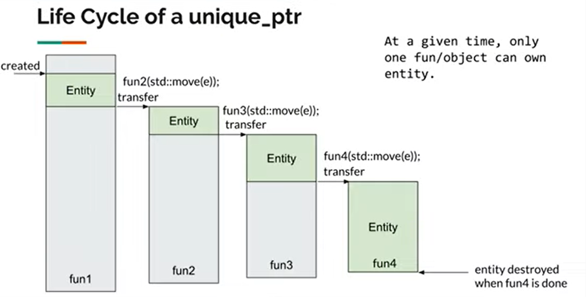
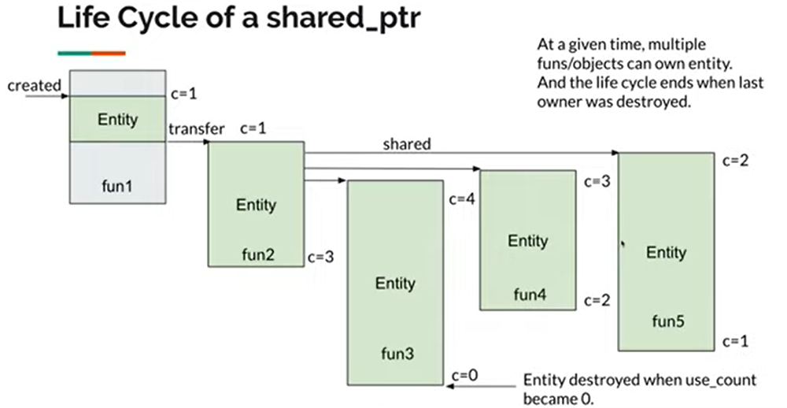

# 

> ## 🅰️提要
>
> **资料出处 :**
>
> - **[Smart Pointers 智能指针 - C++ Weekly EP3](https://www.youtube.com/watch?v=KQt3IjGdqL8&t=5s)**
> - [C++ 智能指针最佳实践&源码分析](https://zhuanlan.zhihu.com/p/436290273)


# 智能指针基础语法


**智能指针类型**

- `std :: unique_ptr` - single ownership
- `std :: shared_ptr` - shared ownership
- `std :: weak_ptr `- temp / no ownership
-  Define in `<memory> `header

思考的要点基本都围绕着 `ownership` 展开


**前置知识：**

[参考 cppreference](https://zh.cppreference.com/w/cpp/memory/shared_ptr/make_shared)

```c++
// 以 args 为 T 的构造函数参数列表，构造 T 类型对象并将它包装于 std::shared_ptr 。
template< class T, class... Args >
shared_ptr<T> make_shared( Args&&... args );
```

**这是下面会用作示例的类定义**

```c++
class Entity {
public:
  Entity() { puts("Entity created!"); }
  ~Entity() { puts("Entity destroyed!"); }
};
```

**感觉要理解智能指针的妙处，还要先了解一下[C++的RALL机制](https://blog.csdn.net/quinta_2018_01_09/article/details/93638251)的妙处**


## unique_ptr

### 合法的初始化

```c++
auto e1 = std:: make_unique<Entity>(); //preferred
std:: unique_ptr<Entity> e1(new Entity()); // ok
std:: unique_ptr<Entity> e2 = std:: move(e1); //movable
```

`std::move()`可以理解为转换所有权 


### 不合法的初始化

```c++
std:: unique_ptr<Entity> e1 = new Entity(); // no-assignable
std:: unique<Entity> e2 = e1 //non-copyable
```


### 传参

```c++
foo(std::move(e1)) // transfer 
```


### 接口

- `get()` 获取其保存的原生指针，**尽量不要使用**
- `bool()` 判断是否拥有指针
- `release()` 释放所管理指针的所有权，返回原生指针。但并不销毁原生指针。
- `reset()` 释放并销毁原生指针。如果参数为一个新指针，将管理这个新指针



> unique_ptr 的生命周期 , 用move实现transfer


## shared_ptr

### 初始化

**(基本上你能想到的都是合法的 ， 但是要注意调用效果**

```c++
std:: shared_ptr<Entity> e1 = std:: make_shared<Entity>(); //prefered
auto e1 = std::make_shared<Entity>(); //preferred
std:: shared_ptr<Entity> e1(new Entity()); // ok
std:: shared_ptr<Entity> e2 = e1; //copyable , use_count + 1
std:: shared_ptr<Entity> e2 = std::move(e1); // movable , use_count remains
```

### 传参

```c++
foo(std::move(e1)); //use_count remains
foo(e1); //use_count + 1;
```

### **接口**

- `get()` 获取其保存的原生指针，**尽量不要使用**
- `bool()` 判断是否拥有指针
- `reset()` 释放并销毁原生指针。如果参数为一个新指针，将管理这个新指针
- `unique() `如果引用计数为 1，则返回 true，否则返回 false
- `use_count()` 返回引用计数的大小




> shared_ptr 的生命周期 ， 上面的c是引用计数的意思


## weak_ptr

​	`weak_ptr` 比较特殊，它主要是为了配合`shared_ptr`而存在的。就像它的名字一样，它本身是一个弱指针，**因为它本身是不能直接调用原生指针的方法的。**如果想要使用原生指针的方法，需要将其先转换为一个`shared_ptr`。

那`weak_ptr`存在的意义到底是什么呢？

由于`shared_ptr`是通过引用计数来管理原生指针的，那么最大的问题就是循环引用（比如 a 对象持有 b 对象，b 对象持有 a 对象），这样必然会导致内存泄露。而`weak_ptr`不会增加引用计数，**因此将循环引用的一方修改为弱引用，可以避免内存泄露。**


`weak_ptr`可以通过一个`shared_ptr`创建。

```c++
std::shared_ptr<A> a1(new A());
std::weak_ptr<A> weak_a1 = a1;//不增加引用计数
```


### **接口**：

- `expired()` 判断所指向的**原生指针**是否被释放，如果被释放了返回 true，否则返回 false
- `use_count() `返回**原生指针**的引用计数
- `lock()` 返回 `shared_ptr`，如果**原生指针**没有被释放，则返回一个**非空的** `shared_ptr`，否则返回一个**空的** `shared_ptr`
- `reset()` 将本身置空

```c++
std::shared_ptr<A> a1(new A());
std::weak_ptr<A> weak_a1 = a1;//不增加引用计数

if(weak_a1.expired())
{
    //如果为true，weak_a1对应的原生指针已经被释放了
}

long a1_use_count = weak_a1.use_count();//引用计数数量

if(std::shared_ptr<A> shared_a = weak_a1.lock()) // weak_a1 指向的对象的引用计数增加
{
    //此时可以通过shared_a进行原生指针的方法调用
}

weak_a1.reset();//将weak_a1置空
```


## 小结

- Time to say goodbye to new / delete

  - Replace raw pointers with smart pointers

- Prefer std: :unique_ptr over std: : shared_ptr.

  > shared_ptr要保证线程安全，开销大一点

- Move std : : share_ptr whenever possible


# 避免/禁忌用法

智能指针的使用时有较多常见的错误用法，可能会导致程序异常。下面我会列举这些错误用法，开发时需要避免。


### **1 . 智能指针和原生指针混用**

对同一个对象会混用智能指针和原生指针，导致程序异常。

```c++
void incorrect_smart_pointer1()
{
    A *a= new A();
    std::unique_ptr<A> unique_ptr_a(a);

    // 此处将导致对象的二次释放
    delete a;
}
```


### **2  .一对多**

如果将**一个原生指针交付个多个智能指针**，这些智能指针释放对象时会产生对象的多次销毁 （本质还是因为这个行为让引用计数与实际情况不符）

```c++
void incorrect_smart_pointer2()
{
    A *a= new A();
    std::unique_ptr<A> unique_ptr_a1(a);
    std::unique_ptr<A> unique_ptr_a2(a);// 此处将导致对象的二次释放
}
```


### **3 .get()获取原生指针**

尽量不要使用 get()获取原生指针 

```c++
void incorrect_smart_pointer3()
{
    std::shared_ptr<A> shared_ptr_a1 = std::make_shared<A>();

    A *a= shared_ptr_a1.get();

    std::shared_ptr<A> shared_ptr_a2(a);// 此处将导致对象的二次释放，主要是这种做法不会让引用计数更新

    delete a;// 此处也将导致对象的二次释放
}
```


### **4 .越俎代庖**

不要将 this 指针直接托管智能指针 ， 释放this指向对象的事由析构函数干。

```c++
class E
{
    void use_this()
    {
        //错误方式，用this指针重新构造shared_ptr，将导致二次释放当前对象
        std::shared_ptr<E> this_shared_ptr1(this);
    }
};

std::shared_ptr<E> e = std::make_shared<E>();
```


智能指针只能管理堆对象，不能管理栈上对象

栈上对象本身在出栈时就会被自动销毁，如果将其指针交给智能指针，会造成对象的二次销毁

```c++
void incorrect_smart_pointer5()
{
    int int_num = 3;
    std::unique_ptr<int> int_unique_ptr(&amp;int_num);
}
```


# 最佳实践

## unique_ptr

`unique_ptr` 一般在不需要多个指向同一个对象的指针时使用。但这个条件本身就很难判断，在我看来可以简单的理解：**这个对象在对象或方法内部使用时优先使用**`unique_ptr`。

**1、对象内部使用**

```c++
class TestUnique
{
private:
    std::unique_ptr<A> a_ = std::unique_ptr<A>(new A());
public:
    void process1()
    {
        a_->do_something();
    }

    void process2()
    {
        a_->do_something();
    }

    ~TestUnique()
    {
        //此处不再需要手动删除a_
    }
};
```

**2、方法内部使用**

```c++
void test_unique_ptr()
{
    std::unique_ptr<A> a(new A());
    a->do_something();
}
```


## shared_ptr

### Demo 0 

`shared_ptr`一般在需要多个执行同一个对象的指针使用。在我看来可以简单的理解：这个对象需要被多个 Class 同时使用的时候。

```c++
class B
{
private:
    std::shared_ptr<A> a_;

public:
    B(std::shared_ptr<A>& a): a_(a) {}
};

class C
{
private:
    std::shared_ptr<A> a_;

public:
    C(std::shared_ptr<A>& a): a_(a) {}
};

std::shared_ptr<B> b_;
std::shared_ptr<C> c_;

void test_A_B_C()
{
    std::shared_ptr<A> a = std::make_shared<A>();
    b_ = std::make_shared<B>(a); // 指向对象B的shared指针，B内部包含一个A的shared指针
    c_ = std::make_shared<C>(a); // 同理
}
```


如果`A`想要调用`B`和`C`的方法怎么办呢？可否在`A`中定义`B`和`C`的`shared_ptr`呢？答案是不可以，**这样会产生循环引用，导致内存泄露。**


此时就需要`weak_ptr`(不会增加引用计数，避免循环引用) 出场了。

```c++
class A
{
private:
    std::weak_ptr<B> b_;
    std::weak_ptr<C> c_;
public:
    void do_something() {}

    void set_B_C(const std::shared_ptr<B>& b, const std::shared_ptr<C>& c)
    {
        b_ = b;
        c_ = c;
    }
};

a->set_B_C(b_, c_);
```


### **Demo 1**

如果想要在`A`内部将当前对象的指针共享给其他对象，需要怎么处理呢？

```c++
class D
{
private:
    std::shared_ptr<A> a_;

public:
    D(std::shared_ptr<A>& a): a_(a) {}
};

class A
{
//上述代码省略

public:
    void new_D()
    {
        //错误方式，用this指针重新构造shared_ptr，将导致二次释放当前对象
        std::shared_ptr<A> this_shared_ptr1(this);
        std::unique_ptr<D> d1(new D(this_shared_ptr1));
    }
};
```

​	如果采用`this`指针重新构造`shared_ptr`是肯定不行的，因为重新创建的`shared_ptr`与当前对象的`shared_ptr`没有关系，没有增加当前对象的引用计数。这将导致任何一个`shared_ptr`计数为 0 时提前释放了对象，后续操作这个释放的对象都会导致程序异常。


此时就需要引入`shared_from_this`。对象继承了`enable_shared_from_this`后，可以通过`shared_from_this()`获取当前对象的`shared_ptr`指针。

```c++
class A: public std::enable_shared_from_this<A>
{
//上述代码省略

public:
    void new_D()
    {
        //错误方式，用this指针重新构造shared_ptr，将导致二次释放当前对象
        std::shared_ptr<A> this_shared_ptr1(this);
        std::unique_ptr<D> d1(new D(this_shared_ptr1));
        //正确方式
        std::shared_ptr<A> this_shared_ptr2 = shared_from_this();
        std::unique_ptr<D> d2(new D(this_shared_ptr2));
    }
};
```


