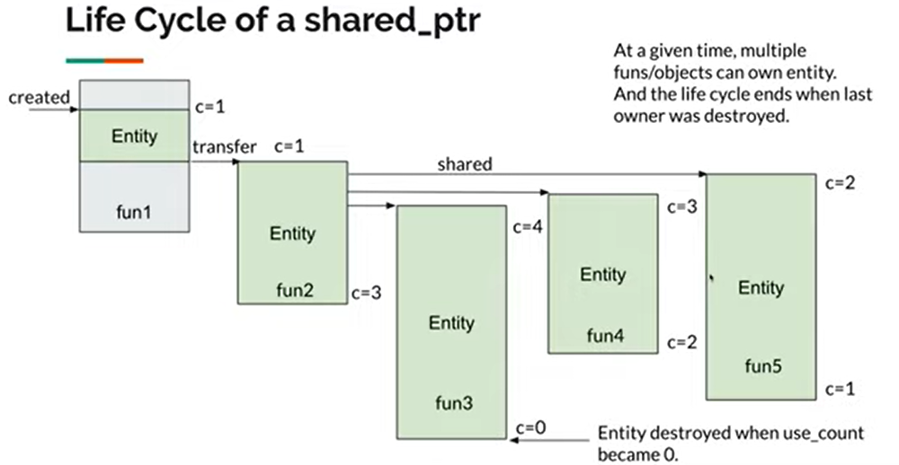

# 智能指针

**reference** : [Smart Pointers 智能指针 - C++ Weekly EP3 (感谢HuaHua酱)](https://www.youtube.com/watch?v=KQt3IjGdqL8&t=5s)


- `std :: unique_ptr` - single ownership
- `std :: shared_ptr` - shared ownership
- `std :: weak_ptr `- temp / no ownership
-  Define in `<memory> `header

思考的要点基本都围绕着 `ownership` 展开

**why smart pointers ?**

```c++
// version 1 no smartptr
void bar(Entity* e){
    // Who ows e ?
    // How long is e's life cycle?
	// Should I delete e ?
}

void foo(){
    Entity* e = new Entity();
    e -> DoSomething();
    bar(e);
}

foo();
// out of scope , memory leak
```

```c++
// version 2  smartptr
void bar(std :: unique_ptr<Entity> e){
    // bar owns e
    // e will be automatically destoryed
}

void foo(){
    auto e = std :: make_unique<Entity>();
    e -> DoSomething();
    bar( std:: move(e) );
}

foo();
// out of scope , memory leak
```


## unique_ptr

### 合法的初始化

```c++
auto ptr = std:: make_unique<Entity>(); //preferred
std:: unique_ptr<Entity> ptr(new Entity()); // ok
std:: unique_ptr<Entity> ptr = std:: move(e1); //movable
```

`std::move()`可以理解为转换所有权 


### 不合法的初始化

```c++
std:: unique_ptr<Entity> ptr = new Entity(); // no-assignable
std:: unique<Entity> ptr = another_unique_ptr //non-copyable
```


### 传参

```c++
foo(std::move(ptr)) // transfer 
```


> unique_ptr 的生命周期 , 用move实现transfer


## shared_ptr

### 初始化

**(基本上你能想到的都是合法的 ， 但是要注意调用效果**

```c++
std:: shared_ptr<Entity> e1 = std:: make_shared<Entity>(); //prefered
auto e1 = std::make_shared<Entity>(); //preferred
std:: shared_ptr<Entity> e1(new Entity()); // ok
std:: shared_ptr<Entity> e2 = e1; //copyable , use_count + 1
std:: shared_ptr<Entity> e2 = std::move(e1); // movable , use_count remains
```

### 传参

```c++
foo(std::move(e1)); //use_count remains
foo(e1); //use_count + 1;
```




> shared_ptr 的生命周期 ， 上面的c是引用计数的意思


## weak_ptr

这个指针的特点就是 temp / No ownership (让人疑惑)

- Must be converted to a std : : shared_ptr before accessing
- Models a temporary ownership （因为 week_ptr 实质是 shared_ptr ）
  - Access if the object still exist
  - OK if the object was already destroyed


### 一般写法

```c++
auto e1 = std : :make_shared<Entity>();
std: :weak_ptr<Entity> ew = e1; // construct from a shared_ptr , e1 use_count remains
if (std::shared_ptr<Entity> e2 = ew.lock()) // convert to a shared_ptr , 这个时候e1的use_count++
   e2->DoSomething();
```


## 小结

- Time to say goodbye to new / delete

  - Replace raw pointers with smart pointers

- Prefer std: :unique_ptr over std: : shared_ptr.

  > shared_ptr要保证线程安全，开销大一点

- Move std : : share_ptr whenever possible